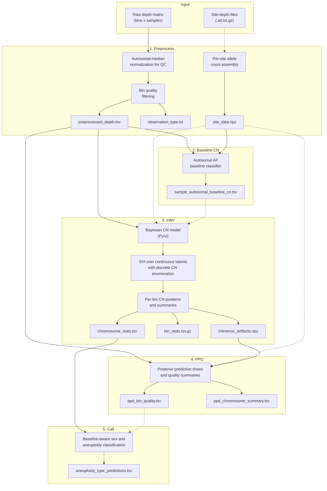

# gatk-sv-ploidy

Whole-genome aneuploidy detection from binned read counts with optional
per-site allele-fraction evidence.

The package implements a baseline-aware pipeline:

1. preprocess raw depth and optionally build per-site AF tensors,
2. optionally classify each sample's autosomal baseline CN as CN1, CN2, CN3,
   or CN4,
3. fit a Pyro-based Bayesian copy-number model,
4. run posterior predictive checks,
5. convert chromosome summaries into sample-level labels,
6. generate plots and a static HTML report,
7. evaluate calls against a truth set.

The current implementation uses a simplified raw-count model only.
`preprocess` writes filtered raw counts, and `infer` / `ppd` require that
raw-count output with the negative-binomial observation model.

## Installation

```bash
pip install -e .
```

The main package does not install Hail. If you need the local-only
`pull-snps` helper, install its extra runtime dependencies separately:

```bash
pip install hail pysam
```

## Usage

```bash
gatk-sv-ploidy <subcommand> [options]
```

### Subcommands

| Subcommand | Description |
|------------|-------------|
| `preprocess` | Normalize internally for QC, filter bins, optionally build `site_data.npz`, and write filtered raw counts |
| `polyploidy` | Classify per-sample autosomal baseline CN from pooled autosomal AF evidence |
| `infer` | Fit the Bayesian CN model and write per-bin and per-chromosome summaries |
| `ppd` | Generate posterior predictive draws and quality / calibration summaries |
| `call` | Assign baseline-aware sex and aneuploidy labels per sample |
| `plot` | Generate diagnostic plots and a static HTML report |
| `eval` | Evaluate predictions against a truth set |
| `pull-snps` | Pull common-SNP sites from gnomAD (requires Hail; local only) |

Run `gatk-sv-ploidy <subcommand> --help` for subcommand-specific options.

## Typical Workflow

The default path is raw-count preprocess output plus the raw-count
negative-binomial observation model chosen automatically by `infer`.

```bash
# 1. Filter depth data and optionally build per-site AF tensors.
gatk-sv-ploidy preprocess -i depth.tsv -o out/preprocess \
  --site-depth-list sample_sd_files.txt

# 2. Optional but recommended when non-diploid autosomal baselines are possible.
gatk-sv-ploidy polyploidy -i out/preprocess/preprocessed_depth.tsv \
  --site-data out/preprocess/site_data.npz \
  -o out/polyploidy \
  --diagnostics

# 3. Fit the Bayesian CN model.
gatk-sv-ploidy infer -i out/preprocess/preprocessed_depth.tsv \
  --site-data out/preprocess/site_data.npz \
  --autosomal-baseline-cn-tsv out/polyploidy/sample_autosomal_baseline_cn.tsv \
  -o out/infer

# 4. Posterior predictive checks.
gatk-sv-ploidy ppd -i out/preprocess/preprocessed_depth.tsv \
  -a out/infer/inference_artifacts.npz \
  --site-data out/preprocess/site_data.npz \
  -o out/ppd

# 5. Convert chromosome summaries into sample-level labels.
gatk-sv-ploidy call -c out/infer/chromosome_stats.tsv -o out/call

# 6. Generate plots and the static report.
gatk-sv-ploidy plot -c out/infer/chromosome_stats.tsv \
  --sex-assignments out/call/aneuploidy_type_predictions.tsv \
  --bin-stats out/infer/bin_stats.tsv.gz \
  --training-loss out/infer/training_loss.tsv \
  --ppd-bin-summary out/ppd/ppd_bin_summary.tsv.gz \
  --ppd-chr-summary out/ppd/ppd_chromosome_summary.tsv \
  -o out/plot

# 7. Evaluate against truth.
gatk-sv-ploidy eval -p out/call/aneuploidy_type_predictions.tsv \
  -t truth.json \
  -o out/eval
```

If all samples are expected to be diploid, or if no `site_data.npz` is
available, you can skip `polyploidy` and omit
`--autosomal-baseline-cn-tsv`. In that case `infer` and `call` use
autosomal baseline CN = 2 for every sample.

Normalized-depth residual inference is no longer supported by the public CLI.
Historical normalized-depth preprocess artifacts must be regenerated as raw
counts before running `infer` or `ppd`.

### Primary Outputs

| Step | Key outputs |
|------|-------------|
| `preprocess` | `preprocessed_depth.tsv`, `observation_type.txt`, optional `site_data.npz` |
| `polyploidy` | `polyploidy_test_results.tsv`, `sample_autosomal_baseline_cn.tsv`, optional diagnostics under `diagnostics/` |
| `infer` | `training_loss.tsv`, `inference_artifacts.npz`, `bin_stats.tsv.gz`, `chromosome_stats.tsv`, `sample_autosomal_baseline_cn.tsv` |
| `ppd` | `ppd_draws.npz`, `ppd_bin_summary.tsv.gz`, `ppd_bin_quality.tsv`, `ppd_chromosome_summary.tsv`, `ppd_global_summary.tsv` |
| `call` | `sex_assignments.txt.gz`, `aneuploidy_type_predictions.tsv`, optional `chromosome_stats.filtered.tsv` when BINQ filtering is used |
| `plot` | `plot_manifest.tsv`, `report/index.html`, linked plot and table artifacts |
| `eval` | `metrics_report.txt`, `predictions_with_truth.tsv` |

### Plot Report

`plot` writes a static HTML report alongside the generated artifacts:

| Path | Description |
|------|-------------|
| `out/plot/report/index.html` | Static cohort report linking the generated figures and tables |
| `out/plot/plot_manifest.tsv` | Manifest with category, title, source path, report path, sample / chromosome tags, and file size |

The report links directly to the original artifacts under locations such as
`out/plot/diagnostics/`, `out/plot/ppd/`, `out/plot/sample_plots/`, and
`out/plot/raw_depth_*`; it does not create duplicate copies of those files.

Helper-generated figures are written as PNG at 450 dpi by default. Add
`gatk-sv-ploidy plot --pdf ...` to switch helper-generated figures to PDF.
The multi-page `median_depth_distributions.pdf` summary remains PDF in either
mode.

If you use the end-to-end wrapper, pass extra PPD CLI options via
`run_ploidy.sh --ppd-args "--continuous-posterior-mode integrated"` and plot
options via `run_ploidy.sh --plot-args "--pdf"`.

## Pipeline Architecture



## Current Defaults

| Component | Default | Meaning |
|-----------|---------|---------|
| `preprocess --output-space` | `raw` | Filters are evaluated on normalized depth, but the written matrix is filtered raw counts |
| `infer --autosome-prior-mode` | `dirichlet` | Strong per-bin CN2 prior on autosomes |
| `infer --guide-type` | `delta` | MAP-style continuous latent fit |
| `infer --multiplicative-factors` | `0` | No low-rank multiplicative bias by default |
| `infer --background-factors` | `0` | No structured additive background by default |
| `infer --var-bin` | `0` | No per-bin residual variance latent by default |
| `infer --freeze-sample-depth` | enabled | Raw-count runs fix sample depth to the autosomal median counts-per-kb anchor |
| `infer --epsilon-mean` | `1e-2` | Small CN0-only epsilon background floor is retained |
| `infer --learn-af-temperature` | enabled | A single global AF temperature is learned by default |
| `infer --cn-inference-method` | `multi-draw` | Expressive guides average CN posteriors over repeated guide draws; with the default delta guide this collapses to the current point estimate |
| `ppd --continuous-posterior-mode` | `conditioned` | Default in-sample QC / BINQ calibration mode |

## Objective And Decision Target

The model's operational target is per-bin discrete copy number
$c_{bs} \in \{0, 1, 2, 3, 4, 5\}$ for bin $b$ and sample $s$, plus the
sample-level autosomal baseline CN $g_s \in \{1, 2, 3, 4\}$ when the optional
`polyploidy` step is used.

Those latent states support four downstream decisions:

1. per-bin posterior CN summaries and quality scores,
2. per-chromosome CN summaries,
3. baseline-aware sample-level sex and aneuploidy labels,
4. posterior predictive calibration summaries used for QC and BINQ filtering.

Important implementation detail: `infer` does not learn whole-genome baseline
ploidy. Baseline CN is either fixed from
`sample_autosomal_baseline_cn.tsv` or defaults to CN2 for every sample.

## Proposed Data-Generating Model

### Observed Data

The pipeline consumes filtered raw counts written by `preprocess`.

Optional per-site allele tensors are stored in `site_data.npz` with arrays such
as `site_alt`, `site_total`, `site_pop_af`, and `site_mask`.

### Preprocess

`preprocess` always normalizes raw depth internally for QC:

$$
x^{\mathrm{norm}}_{bs} = \frac{2 x^{\mathrm{raw}}_{bs}}{m_s},
\qquad
m_s = \operatorname{median}\{x^{\mathrm{raw}}_{bs} : b \in \text{autosomes}\}.
$$

That normalized view is used for bin filtering even when the written output is
raw counts. The current filtering logic:

- removes autosomal bins with outlying cohort median or MAD,
- filters chrX and chrY within rough XX-like and XY-like groups,
- removes bins with excessive cohort-wide deviation from the expected ploidy,
- optionally removes bins overlapping poor regions,
- collapses long contigs into larger contiguous bins while retaining at least
  the requested number of bins per contig.

When site-depth files are provided, `preprocess` bins sites, defines the cohort
major allele per site, records per-sample alternate and total counts, estimates
`site_pop_af` from pooled cohort data, and pads or subsamples each bin to a
fixed maximum number of sites.

### Autosomal Baseline CN Classifier (`polyploidy`)

`polyploidy` is a separate evidence model for sample-level autosomal baseline
CN in states CN1, CN2, CN3, and CN4. It uses only autosomal informative sites.
Sites are screened by a diploid heterozygosity prior based on the current
`site_pop_af` estimate so that uninformative near-fixed sites do not dominate
the evidence.

For each sample and baseline state $g_s = c$, the classifier combines two AF
signals:

1. a beta-binomial genotype-mixture likelihood marginalized over genotype copy
   states and over a grid of AF concentration values,
2. a direct peak-mixture score around the canonical AF peaks for CN1, CN2,
   CN3, and CN4.

The genotype-mixture term is:

$$
P(\text{AF}_s \mid g_s = c)
\propto
\int
\prod_j
\sum_{k=0}^{c}
P(K_j = k \mid c, p_j)
\; P(a_{js} \mid n_{js}, K_j = k, \kappa)
\; p(\kappa) \, d\kappa,
$$

where $p_j$ is the site population AF, $k$ is the genotype alt-copy count, and
$\kappa$ is the beta-binomial concentration parameter.

The direct peak checks are conservative by design:

- CN1 requires strong endpoint support near AF 0 and 1 with little mass near
  half, thirds, or quarters.
- CN3 requires explicit thirds support near AF 1/3 and 2/3.
- CN4 requires explicit quarter support near AF 1/4 and 3/4; evidence that is
  only compatible with 0, 0.5, and 1 is kept diploid.

Non-diploid baseline calls require all of the following:

1. enough informative autosomal bins and sites,
2. posterior error probability below `--pvalue-threshold`,
3. positive log Bayes factor versus CN2,
4. effect size per informative site above `--effect-size-threshold`,
5. direct peak support for the candidate state.

If those conditions are not met, the classifier defaults to CN2 and records the
reason in `polyploidy_test_results.tsv`. This is the intended failure-safe
behavior for sparse or ambiguous AF data.

## Assumptions And Justifications

### Domain-Supported Assumptions

- Most autosomal bins are neutral in most cohorts, so a strong autosomal CN2
  prior is appropriate unless the user explicitly chooses the hierarchical
  shrinkage prior mode.
- The autosomal median depth is a stable per-sample anchor for preprocess QC
  and, in the default raw-count model, for the fixed `sample_depth` scale.
- chrX and chrY require separate prior handling because expected copy number
  depends on sex karyotype.
- AF evidence should be aggregated over genotype uncertainty rather than by
  hard-calling genotype states from observed allele fractions.

### Convenience-Driven Assumptions

- `infer` conditions on a fixed autosomal baseline CN manifest instead of
  learning whole-genome ploidy jointly with per-bin CN.
- The default model removes low-rank multiplicative bias, structured additive
  background, per-bin residual variance, and allosome-specific extra variance to
  improve identifiability and reduce false high-copy fits.
- The default AF pathway learns a single global temperature rather than a more
  flexible bin-specific AF calibration term.

### Explicitly Unverified Or User-Tunable Assumptions

- The fixed autosomal median counts-per-kb anchor can be wrong for some raw
  count cohorts; use `--learn-sample-depth` when that anchor is not appropriate.
- The site AF values produced by `preprocess` may be improved by infer-time
  naive-Bayes re-estimation or by `--learn-site-af`, depending on cohort
  quality.
- Historical normalized-depth preprocess artifacts must be regenerated as raw
  counts before they can be used with the current `infer` / `ppd` CLI.

## Likelihoods, Priors, And Inference Strategy

### Latent Structure In `infer`

For each sample $s$ and bin $b$, the model includes:

- discrete CN state $c_{bs} \in \{0, \dots, 5\}$,
- optional per-sample sex latent $z_s \in \{\mathrm{XX}, \mathrm{XY}\}$ used to
  couple chrX / chrY priors,
- per-bin CN prior parameters,
- continuous depth-model latents such as sample variance, optional low-rank
  multiplicative bias, and optional additive background.

The baseline CN $g_s$ is fixed input, not a latent variable in `infer`.

### Depth Model

#### Raw-count default

When preprocess output is raw and `infer` is left at the defaults, the expected
count for bin $b$, sample $s$ is modeled as:

$$
\mu_{bs} = L_b D_s
\frac{c_{bs} M_{bs} + \mathbf{1}(c_{bs} = 0) A_{bs}}{2},
$$

where:

- $L_b$ is bin length in kilobases,
- $D_s$ is the sample-specific diploid depth scale,
- $M_{bs}$ is the multiplicative bias term,
- $A_{bs}$ is the additive background term.

With the current defaults, `freeze_sample_depth` is on, so $D_s$ is fixed to
the autosomal median counts-per-kb anchor, `multiplicative_factors=0` forces
$M_{bs} = 1$, `background_factors=0` disables structured background, and the
remaining epsilon floor contributes only when $c_{bs} = 0$.

The raw-count likelihood is negative-binomial-like with power-law extra-Poisson
variance:

$$
\operatorname{Var}(Y_{bs}) = \mu_{bs} + V_{bs} \mu_{bs}^{\rho},
$$

with default $\rho = 1.5$. By default $V_{bs}$ is driven only by the
sample-specific variance term because `var_bin=0`.

Normalized-depth residual inference is no longer exposed by the public CLI.

### CN Priors

Autosomes use one of two prior families:

1. `dirichlet` (default): per-bin CN simplex with strong CN2 concentration
   (`alpha_ref=50`, `alpha_non_ref=1` by default),
2. `shrinkage`: hierarchical autosomal non-reference mass plus a separate
   alternative-state simplex.

chrX and chrY use flat Dirichlet concentrations by default, with the
sex-karyotype latent providing the main prior regularization via
`--sex-cn-weight`.

### Allele-Fraction Evidence In `infer`

When `site_data.npz` is provided and `--af-weight > 0`, the model adds a
per-bin AF term marginalized over genotype copy counts:

$$
\ell^{\mathrm{AF}}_{bs}(c) =
\sum_j
\log
\sum_{k=0}^{c}
P(K_j = k \mid c, p_{bj})
\; P(a_{bjs} \mid n_{bjs}, K_j = k, \kappa).
$$

Current implementation details:

- default `af_evidence_mode=relative` centers AF evidence against a fixed CN
  reference mixture before scaling,
- default `learn_af_temperature` learns a single global AF temperature whose
  prior median is `af_weight=0.25`,
- unless `--learn-site-af` is used, the AF table is precomputed once because it
  depends only on observed site data and the discrete CN state,
- `--site-af-estimator auto` may replace the input `site_pop_af` with a
  naive-Bayes estimate when the current encoding is coherent enough to do so
  safely.

Setting `--af-weight 0` disables AF evidence entirely.

### Variational Inference And Discrete CN Inference

Continuous latents are trained with Pyro SVI using `TraceEnum_ELBO`, so the
discrete CN states are analytically enumerated during training.

Guide options:

- `delta` (default): MAP-style point estimate,
- `diagonal`: mean-field Gaussian guide,
- `lowrank`: low-rank multivariate Gaussian guide.

Expressive guides can warm-start from a short AutoDelta stage, and early
stopping compares rolling ELBO windows using `--elbo-window` and
`--elbo-rtol`. Gradient clipping is enabled by default.

After training, `infer` computes bin-level CN posteriors. The handling of
continuous-latent uncertainty is controlled by `--cn-inference-method`:

- `current`: use the current guide draw,
- `median`: plug in guide medians,
- `multi-draw` (default): average CN posteriors over repeated guide draws.

With the default `delta` guide, these reduce to the same deterministic point
estimate behavior.

## Robustness Strategy For Sparse Or Poor-Quality Data

- `preprocess` filters in normalized space even when the written output is raw,
  which keeps QC thresholds interpretable.
- The default simplified infer model removes weakly identified low-rank terms
  unless the user explicitly opts into them.
- `polyploidy` defaults to CN2 when evidence is sparse, contradictory, or lacks
  explicit thirds / quarter-peak support.
- AF evidence is optional and temperature-scaled; this reduces the chance that
  miscalibrated AF likelihoods dominate depth evidence.
- `call` can rebuild chromosome summaries after excluding low-quality bins using
  `--bin-stats`, `--ppd-bin-quality`, and `--min-binq`.
- `polyploidy --privacy-safe-diagnostics` logs aggregate-only summaries for
  protected manual debugging.

## Scaling Strategy For Small And Large Datasets

The current implementation is designed to stay usable across small and large
cohorts:

- small datasets benefit from strong CN2 priors, conservative non-diploid
  calling thresholds, and the default simpler latent structure,
- large datasets benefit from bin collapsing in `preprocess`, fixed-width site
  tensors, AF lookup-table precomputation, and optional omission of site-level
  modeling when AF data is unavailable or too expensive,
- expressive guides and integrated PPD are available, but they are optional
  because they cost more memory and compute than the default delta guide and
  conditioned PPD path.

## Confidence Outputs And Thresholding Guidance

The pipeline exposes multiple confidence outputs rather than a single hard call:

- `polyploidy_test_results.tsv` contains posterior probabilities, posterior
  error probabilities, effect sizes per informative site, direct-peak support
  flags, and reason codes.
- `bin_stats.tsv.gz` contains per-bin CN summaries and quality metrics.
- `chromosome_stats.tsv` contains chromosome-level CN, mean posterior support,
  ploidy fractions, and the fixed autosomal baseline CN used for that sample.
- `ppd_bin_quality.tsv` provides PPD-derived BINQ and CALLQ metrics.
- `aneuploidy_type_predictions.tsv` separates
  `baseline_ploidy_type`, `autosomal_aneuploidy_type`,
  `allosomal_aneuploidy_type`, and `predicted_aneuploidy_type`.

Current calling semantics:

- diploid-baseline samples use the legacy summary labels `NORMAL`, `MULTIPLE`,
  named sex-aneuploidy labels, named trisomy / tetrasomy labels for chr13,
  chr18, and chr21, or `OTHER`,
- non-diploid baselines are reported explicitly as `HAPLOID`, `TRIPLOID`,
  `TETRAPLOID`, or `BASELINE_CN*`, optionally composed with
  `_WITH_AUTOSOMAL_ANEUPLOIDY`, `_WITH_ALLOSOME_ANEUPLOIDY`, or
  `_WITH_MULTIPLE_ANEUPLOIDY`,
- the `sex` field is also baseline-aware: for example a baseline-CN3 sample can
  be labeled `TRIPLOID_FEMALE` or `TRIPLOID_MALE` instead of being forced into
  diploid sex-aneuploidy labels.

## Validation And Falsification Plan

The implementation provides three main validation surfaces:

1. `ppd` for posterior predictive checks and bin-level quality metrics,
2. `plot` for visual diagnostics and cohort-wide reports,
3. `eval` for truth-set comparison when labeled samples are available.

`ppd` has two modes:

- `conditioned` (default): fix fitted continuous latents and resample CN plus
  observation noise; this is the intended in-sample QC / BINQ calibration path,
- `integrated`: include saved continuous-latent posterior draws when available;
  this is more conservative and better reflects parameter uncertainty for
  expressive guides.

When `call` is provided with `--min-binq`, it can use `ppd_bin_quality.tsv` to
rebuild chromosome calls after excluding low-quality bins. This is the intended
post-fit falsification check for bins that look inconsistent with the fitted
model.

## Expected Failure Modes

- If no `site_data.npz` is available, AF evidence and baseline-CN classification
  are unavailable; the pipeline falls back to depth-only inference with
  autosomal baseline CN = 2.
- If the fixed autosomal median counts-per-kb anchor is poor, the default raw
  model can mis-scale whole-sample depth. Use `--learn-sample-depth` in those
  cohorts.
- If AF evidence is miscalibrated for a cohort, it can still shift CN posteriors
  even with temperature learning. Compare depth-only and AF-enabled behavior,
  inspect PPD summaries, and use the privacy-safe diagnostics when needed.
- If you enable low-rank multiplicative or additive components without enough
  data, they can absorb biological signal or reintroduce identifiability
  problems. The defaults keep those components off for that reason.
- Baseline-aware labels are only as good as the supplied baseline CN manifest.
  If `polyploidy` is wrong or skipped when non-diploid baselines are present,
  downstream autosomal and allosomal labels will be interpreted in the wrong
  frame.
