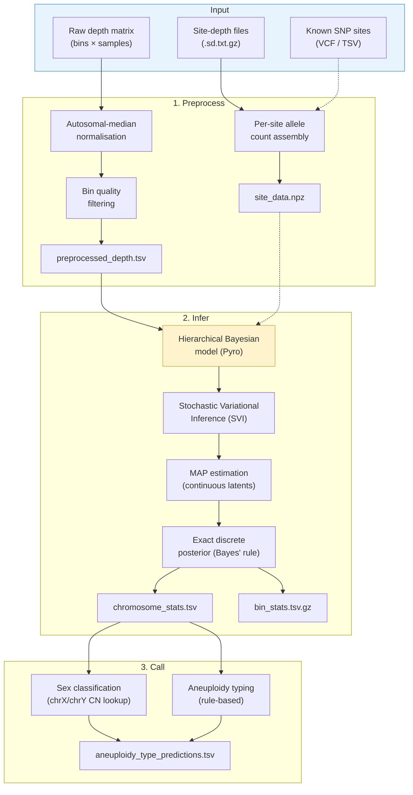
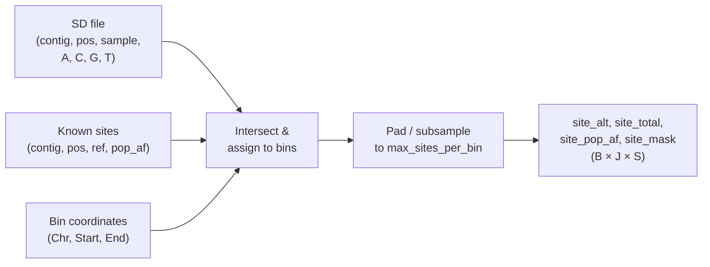
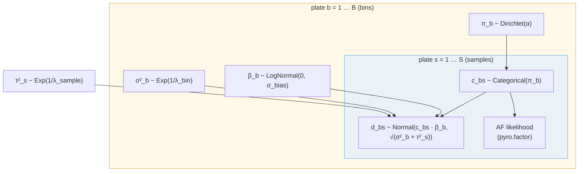
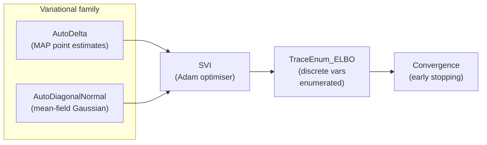
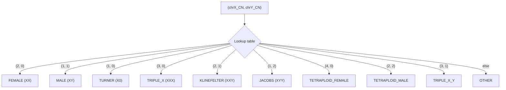

# gatk-sv-ploidy

Whole-genome aneuploidy detection from binned read counts using a hierarchical
Bayesian model (Pyro).

## Installation

```bash
pip install -e .
```

## Usage

```bash
gatk-sv-ploidy <subcommand> [options]
```

### Subcommands

| Subcommand   | Description |
|-------------|-------------|
| `preprocess` | Read and normalise depth data, filter low-quality bins |
| `infer`      | Train Bayesian model and run discrete CN inference |
| `call`       | Assign sex karyotype and aneuploidy type per sample |
| `plot`       | Generate diagnostic and summary plots |
| `eval`       | Evaluate predictions against a truth set |

Run `gatk-sv-ploidy <subcommand> --help` for subcommand-specific options.

## Typical workflow

```bash
# 1. Preprocess raw depth data
gatk-sv-ploidy preprocess -i depth.tsv -o out/

# 2. Run Bayesian inference
gatk-sv-ploidy infer -i out/preprocessed_depth.tsv -o out/

# 3. Call sex and aneuploidy types
gatk-sv-ploidy call -c out/chromosome_stats.tsv -o out/

# 4. Generate plots
gatk-sv-ploidy plot -c out/chromosome_stats.tsv -o out/ \
    --bin-stats out/bin_stats.tsv.gz --training-loss out/training_loss.tsv

# 5. Evaluate against truth
gatk-sv-ploidy eval -p out/aneuploidy_type_predictions.tsv \
    -t truth.json -o out/
```

---

## Pipeline architecture



---

## Mathematical description

### Notation

| Symbol | Meaning |
|--------|---------|
| $B$ | Number of genomic bins after filtering |
| $S$ | Number of samples |
| $C$ | Number of CN states (default 6, for CN $\in \{0,1,2,3,4,5\}$) |
| $d_{bs}$ | Observed normalised depth at bin $b$, sample $s$ |
| $c_{bs}$ | Latent integer copy number at bin $b$, sample $s$ |
| $\beta_b$ | Per-bin multiplicative bias |
| $\sigma^2_b$ | Per-bin variance |
| $\tau^2_s$ | Per-sample variance |
| $\boldsymbol{\pi}_b$ | Per-bin CN-state probability simplex ($C$-vector) |
| $a_{bjs}$ | Alt allele count at site $j$ in bin $b$, sample $s$ |
| $n_{bjs}$ | Total read depth at site $j$ in bin $b$, sample $s$ |
| $p_{bj}$ | Population alt-allele frequency at site $j$ in bin $b$ |

---

### 1. Preprocessing

#### 1.1 Autosomal-median normalisation

**Goal.** Transform raw per-sample read-depth counts to a common scale where
diploid copy number ≈ 2.0, removing library-size and GC-content batch effects.

For each sample $s$, let $\tilde{m}_s$ be the median depth across all
autosomal bins:

$$\tilde{m}_s = \operatorname{median}\bigl\{d^{\text{raw}}_{bs} : b \in \text{autosomes}\bigr\}$$

Every bin (including sex chromosomes) is then rescaled:

$$d_{bs} = \frac{2\,d^{\text{raw}}_{bs}}{\tilde{m}_s}$$

**Justification.** The median is robust to the small fraction of
aneuploid bins that may be present in the data (e.g. ~2% for a trisomy
sample). Scaling to 2.0 rather than 1.0 keeps the expected depth equal to the
integer copy number for diploid regions, making priors and likelihoods
interpretable on a natural scale.

#### 1.2 Bin quality filtering

Bins whose cross-sample statistics lie outside expected ranges are removed
to eliminate mappability artefacts, centromeric noise, and collapse/expansion
regions. For each bin $b$, define:

$$\mu_b = \operatorname{median}_s\{d_{bs}\}, \qquad
  \text{MAD}_b = \operatorname{median}_s\bigl\{|d_{bs} - \mu_b|\bigr\}$$

Separate thresholds are applied per chromosome type because sex chromosomes
have an inherently bimodal depth distribution (XX vs. XY samples):

| Chromosome type | Median range | MAD upper bound |
|-----------------|:------------:|:---------------:|
| Autosomes | $[1.0,\; 3.0]$ | $2.0$ |
| chrX | $[0.0,\; 3.0]$ | $2.0$ |
| chrY | $[0.0,\; 3.0]$ | $2.0$ |

A post-filter check ensures at least 10 bins survive per chromosome;
otherwise the run fails with a diagnostic message.

**Justification.** The median/MAD pair is more robust to outliers than
mean/std. The liberal autosome lower bound (1.0 rather than ~1.8) avoids
discarding real monosomic signal; the primary purpose is to remove
zero-mappability and extreme-repeat bins.

#### 1.3 Per-site allele data assembly

When per-sample site-depth (SD) files are provided, allele counts at known
SNP positions are aggregated into a 3-D tensor aligned to the genomic bins.



For each SD file, positions are intersected with known SNP sites via sorted
`searchsorted` lookup. At each matching site, the **reference allele count**
is extracted using the known reference base, and:

$$a_{bjs} = n_{bjs} - \text{ref\_count}_{bjs}$$

where $n_{bjs} = A + C + G + T$ is the total depth. Sites with
$n_{bjs} < 10$ (configurable) are discarded to suppress noise from
low-coverage positions.

When no known-sites file is provided, a **fallback mode** uses every SD
position with `pop_af = 0.5` and defines the alt count as
$n - \max(A, C, G, T)$ (minor allele count).

Each bin is padded or subsampled to a fixed width $J_{\max}$ (default 50)
with a boolean validity mask $m_{bjs}$ tracking real entries. The result is
stored as a compressed `.npz` archive with arrays:

- `site_alt`: $\mathbb{Z}^{B \times J_{\max} \times S}$
- `site_total`: $\mathbb{Z}^{B \times J_{\max} \times S}$
- `site_pop_af`: $\mathbb{R}^{B \times J_{\max}}$ (broadcast across samples)
- `site_mask`: $\{0,1\}^{B \times J_{\max} \times S}$

**Justification.** Padding to a fixed width enables efficient batched tensor
operations during inference. The `searchsorted` intersection avoids O(N²)
joins and is critical when SD files contain ~50 M rows.

---

### 2. Inference model

#### 2.1 Generative model (plate diagram)



#### 2.2 Prior specification

The full joint prior is:

$$
\begin{aligned}
\tau^2_s &\sim \operatorname{Exponential}\!\left(\tfrac{1}{\lambda_{\text{sample}}}\right)
  && \text{per-sample variance} \\[4pt]
\beta_b &\sim \operatorname{LogNormal}(0,\; \sigma_{\text{bias}})
  && \text{per-bin bias} \\[4pt]
\sigma^2_b &\sim \operatorname{Exponential}\!\left(\tfrac{1}{\lambda_{\text{bin}}}\right)
  && \text{per-bin variance} \\[4pt]
\boldsymbol{\pi}_b &\sim \operatorname{Dirichlet}(\boldsymbol{\alpha})
  && \text{per-bin CN prior}
\end{aligned}
$$

The Dirichlet concentration vector $\boldsymbol{\alpha}$ encodes a strong
prior expectation that most bins are diploid:

$$\alpha_c = \begin{cases}
\alpha_{\text{ref}} & \text{if } c = 2 \\
\alpha_{\text{non-ref}} & \text{otherwise}
\end{cases}$$

| Parameter | Default | Rationale |
|-----------|:-------:|-----------|
| $\alpha_{\text{ref}}$ | 50.0 | Strongly favours CN = 2 for most bins |
| $\alpha_{\text{non-ref}}$ | 1.0 | Flat prior across non-reference states |
| $\sigma_{\text{bias}}$ | 0.1 | Tight prior: bin biases close to 1.0 |
| $\lambda_{\text{sample}}$ | 0.2 | Moderate per-sample noise |
| $\lambda_{\text{bin}}$ | 0.2 | Moderate per-bin noise |

**Justification.** In a typical WGS cohort, >99% of autosomal bins are
diploid. Setting $\alpha_{\text{ref}} \gg \alpha_{\text{non-ref}}$ regularises
the model toward CN = 2 unless the depth evidence strongly supports an
alternative state. The LogNormal prior on $\beta_b$ ensures positivity
and centres the bias at 1.0 (i.e. no bias). Exponential priors on variance
components are weakly informative and conjugate-like for Gaussian models.

#### 2.3 Depth likelihood

Conditioned on the latent copy number $c_{bs}$ and continuous parameters,
observed normalised depth is:

$$d_{bs} \mid c_{bs}, \beta_b, \sigma^2_b, \tau^2_s
  \;\sim\; \mathcal{N}\!\bigl(c_{bs} \cdot \beta_b,\;\;
  \sigma^2_b + \tau^2_s\bigr)$$

The mean is the product of integer copy number and a per-bin bias term. The
variance decomposes into a bin-specific component (capturing mappability and
GC variation) and a sample-specific component (capturing library quality).

#### 2.4 Marginalised allele-fraction likelihood

When per-site allele count data is available, the model augments the depth
likelihood with an allele-fraction term that is analytically marginalised
over latent SNP genotype states at each site.

For a site $j$ in bin $b$ at sample $s$, given copy number $c_{bs} = c$,
the number of alt alleles $k$ ranges from $0$ to $c$. The marginalised
likelihood is:

$$
P(a_{bjs} \mid c,\, p_{bj},\, n_{bjs})
= \sum_{k=0}^{c}
  \underbrace{\binom{c}{k}\, p_{bj}^k\,(1-p_{bj})^{c-k}}_{\text{genotype prior}}
  \;\cdot\;
  \underbrace{\operatorname{BetaBin}(a_{bjs} \mid \alpha_k,\, \beta_k,\, n_{bjs})}_{\text{allele-fraction likelihood}}
$$

where the Beta-Binomial parameters are determined by the expected allele
fraction for genotype state $k$ at copy number $c$:

$$\alpha_k = \kappa \cdot \frac{k}{c} + \varepsilon,
\qquad
\beta_k = \kappa \cdot \left(1 - \frac{k}{c}\right) + \varepsilon$$

with concentration $\kappa = 50$ (default) and $\varepsilon = 10^{-6}$ for
numerical stability.

**Special cases:**
- **CN = 0** ($c = 0$): Only $k = 0$ is valid; the likelihood is flat
  ($\alpha = \beta = \kappa/2$), contributing no allele-fraction information.
- **CN = 1** ($c \in \{0, 1\}$): Two genotype states — homozygous reference
  or homozygous alt — producing strongly peaked Beta-Binomial densities
  near 0 or 1.
- **CN = 2** ($c \in \{0, 1, 2\}$): The classic diploid case with
  expected AFs of 0, 0.5, and 1.0.

The per-bin AF log-likelihood sums over all valid sites:

$$\ell^{\text{AF}}_{bs}(c) = \sum_{j:\, m_{bjs}=1}
  \log P(a_{bjs} \mid c,\, p_{bj},\, n_{bjs})$$

This is injected into the model via `pyro.factor("af_lik", w · ℓ_AF)` with
configurable weight $w$ (default 1.0).

**Justification.** Marginalising over genotype states avoids the
circular-reasoning problem of pre-filtering SNPs by observed allele fraction
(which would bias against detecting CN changes). The Binomial genotype prior
weighted by population allele frequency correctly accounts for the expected
genotype distribution at each copy number. The Beta-Binomial (rather than
plain Binomial) observation model accommodates overdispersion from
sequencing noise and mapping artefacts.

**Precomputation optimisation.** The AF log-likelihood depends only on
observed data and the discrete CN state — not on any continuous latent
variables. It is therefore computed **once** before SVI training as a lookup
table of shape $(C \times B \times S)$, reducing per-iteration cost by
orders of magnitude.

#### 2.5 Variational inference

The model is trained via **Stochastic Variational Inference (SVI)**
using Pyro's `TraceEnum_ELBO`, which analytically enumerates over the
discrete $c_{bs}$ variables and optimises the Evidence Lower Bound (ELBO)
for the continuous latents.

The ELBO maximisation problem is:

$$\max_{q} \;\; \mathcal{L}(q)
= \mathbb{E}_{q(\theta)}\!\left[
  \log p(\mathbf{d}, \theta) - \log q(\theta)
\right]$$

where $\theta = \{\beta_b, \sigma^2_b, \tau^2_s, \boldsymbol{\pi}_b\}$ are
the continuous latent variables and the discrete $c_{bs}$ are summed out
analytically inside the ELBO.



**Guide options:**

| Guide | Variational family | Use case |
|-------|--------------------|----------|
| `AutoDelta` | $q(\theta) = \delta(\theta - \hat\theta)$ | Fast MAP; no uncertainty |
| `AutoDiagonalNormal` | $q(\theta) = \prod_i \mathcal{N}(\mu_i, \sigma_i^2)$ | Mean-field; captures variance |

**Learning rate schedule.** An exponential decay from `lr_init` to `lr_min`:

$$\eta_k = \eta_{\min} + (\eta_{\text{init}} - \eta_{\min})\,e^{-k/\tau_{\text{decay}}}$$

with defaults $\eta_{\text{init}} = 0.02$, $\eta_{\min} = 0.01$,
$\tau_{\text{decay}} = 500$.

**Early stopping.** Training halts when the ELBO has not improved by at least
$\delta_{\min}$ (default 1000) for `patience` consecutive epochs (default 50).

#### 2.6 Exact discrete posterior

After SVI converges, the continuous latents are fixed at their MAP values.
The posterior over $c_{bs}$ is then computed in closed form via Bayes' rule
over the finite state space:

$$
P(c_{bs} = c \mid d_{bs}, \hat\theta)
\;\propto\;
\underbrace{\hat\pi_{b,c}}_{\text{prior}}
\;\cdot\;
\underbrace{\mathcal{N}\!\bigl(d_{bs}\,;\; c \cdot \hat\beta_b,\;
\hat\sigma^2_b + \hat\tau^2_s\bigr)}_{\text{depth likelihood}}
\;\cdot\;
\underbrace{\exp\!\bigl(w \cdot \ell^{\text{AF}}_{bs}(c)\bigr)}_{\text{AF likelihood}}
$$

for $c = 0, 1, \ldots, C-1$. The normalisation constant is the sum over all
$C$ states. This replaces Monte Carlo sampling with an exact computation
over the $C = 6$ states, producing a posterior probability vector
$\mathbf{q}_{bs} \in \Delta^{C-1}$ for every (bin, sample) pair.

**Justification.** Once the continuous parameters are fixed, the discrete
posterior factorises across (bin, sample) pairs, each with only 6 states —
making exhaustive enumeration both exact and trivially cheap compared to the
SVI training loop.

---

### 3. Calling

The `call` subcommand converts per-bin CN posteriors into sample-level sex
karyotype assignments and aneuploidy type predictions.

#### 3.1 Per-chromosome CN assignment

For each (sample, chromosome) pair, the **chromosome-level CN** is the mode
of the per-bin MAP CN values, weighted by the bin count:

$$\hat{c}_{\text{chr}} = \arg\max_c \;\sum_{b \in \text{chr}} \mathbb{1}[c_{bs} = c]$$

The associated confidence score is the mean posterior probability of the
modal state across bins on that chromosome:

$$\text{score}_{\text{chr}}
= \frac{1}{|\{b \in \text{chr}\}|}
  \sum_{b \in \text{chr}} P(c_{bs} = \hat{c}_{\text{chr}} \mid d_{bs}, \hat\theta)$$

A chromosome is flagged as **aneuploid** when $\hat{c}_{\text{chr}} \neq 2$
(autosomes) or when the sex-chromosome pair does not match a normal XX/XY
karyotype, provided $\text{score}_{\text{chr}}$ exceeds a configurable
threshold (default 0.5).

#### 3.2 Sex karyotype classification

Sex is assigned by deterministic lookup on the (chrX CN, chrY CN) pair:



#### 3.3 Aneuploidy type classification

Aneuploidy types are assigned by a rule-based decision tree applied to the
set of chromosomes flagged as aneuploid:

1. **No aneuploid chromosomes** → `NORMAL`
2. **Genome-wide tetraploidy** (≥80% of autosomes at CN = 4) → `TETRAPLOID`
3. **Multiple autosomal or mixed auto+sex** → `MULTIPLE`
4. **Sex-only aneuploidy** → mapped via the karyotype table above
   (e.g. `KLINEFELTER`, `TURNER`, `TRIPLE_X`, `JACOBS`)
5. **Single autosomal aneuploidy** → named trisomy/tetrasomy when on a
   clinically recognised chromosome:

| Chromosome | CN | Type |
|:----------:|:--:|:----:|
| chr21 | 3 | `TRISOMY_21` |
| chr18 | 3 | `TRISOMY_18` |
| chr13 | 3 | `TRISOMY_13` |
| chr21 | 4 | `TETRASOMY_21` |
| chr18 | 4 | `TETRASOMY_18` |
| chr13 | 4 | `TETRASOMY_13` |
| other | any | `OTHER` |

**Justification.** The three viable autosomal trisomies (13, 18, 21) are
the most clinically relevant and are specifically named. Other autosomal
aneuploidies are rare in viable samples and are grouped under `OTHER`.
The 80% threshold for tetraploidy detection allows for a small number of
bins with noisy CN estimates while still requiring near-genome-wide signal.
