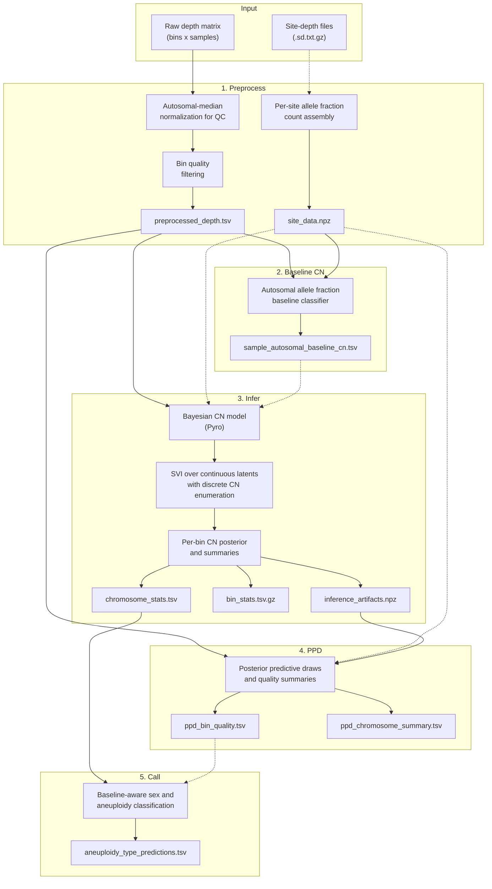

# gatk-sv-ploidy

Whole-genome aneuploidy detection from binned read counts with optional
per-site allele fraction evidence.

The package implements a baseline-aware pipeline:

1. preprocess raw depth and optionally build per-site allele fraction tensors,
2. optionally classify each sample's autosomal baseline CN as CN1, CN2, CN3,
   or CN4,
3. fit a Pyro-based Bayesian copy-number model,
4. run posterior predictive checks,
5. convert chromosome summaries into sample-level labels,
6. generate plots and a static HTML report,
7. evaluate calls against a truth set.

The current implementation uses a simplified raw-count model only.
`preprocess` writes filtered raw counts, and `infer` / `ppd` require that
raw-count output with the negative-binomial observation model. Historical
normalized-depth residual inference is not part of the public CLI.

## Installation

```bash
pip install -e .
```

The main package does not install Hail. If you need the local-only
`pull-snps` helper, install its extra runtime dependencies separately:

```bash
pip install hail pysam
```

## Usage

```bash
gatk-sv-ploidy <subcommand> [options]
```

### Subcommands

| Subcommand | Description |
|------------|-------------|
| `preprocess` | Normalize internally for QC, filter bins, optionally build `site_data.npz`, and write filtered raw counts |
| `polyploidy` | Classify per-sample autosomal baseline CN from pooled autosomal allele fraction evidence |
| `infer` | Fit the Bayesian CN model and write per-bin and per-chromosome summaries |
| `ppd` | Generate posterior predictive draws and quality / calibration summaries |
| `call` | Assign baseline-aware sex and aneuploidy labels per sample |
| `plot` | Generate diagnostic plots and a static HTML report |
| `eval` | Evaluate predictions against a truth set |
| `pull-snps` | Pull common-SNP sites from gnomAD (requires Hail; local only) |

Run `gatk-sv-ploidy <subcommand> --help` for subcommand-specific options.

## Typical Workflow

The default path is raw-count preprocess output plus the raw-count
negative-binomial observation model chosen automatically by `infer`.

```bash
# 1. Filter depth data and optionally build per-site allele fraction tensors.
gatk-sv-ploidy preprocess -i depth.tsv -o out/preprocess \
  --site-depth-list sample_sd_files.txt

# 2. Optional but recommended when non-diploid autosomal baselines are possible.
gatk-sv-ploidy polyploidy -i out/preprocess/preprocessed_depth.tsv \
  --site-data out/preprocess/site_data.npz \
  -o out/polyploidy \
  --diagnostics

# 3. Fit the Bayesian CN model.
gatk-sv-ploidy infer -i out/preprocess/preprocessed_depth.tsv \
  --site-data out/preprocess/site_data.npz \
  --autosomal-baseline-cn-tsv out/polyploidy/sample_autosomal_baseline_cn.tsv \
  -o out/infer

# 4. Posterior predictive checks.
gatk-sv-ploidy ppd -i out/preprocess/preprocessed_depth.tsv \
  -a out/infer/inference_artifacts.npz \
  --site-data out/preprocess/site_data.npz \
  -o out/ppd

# 5. Convert chromosome summaries into sample-level labels.
# --min-binq is optional. It removes low-quality bins before rebuilding
# chromosome summaries and final labels.
gatk-sv-ploidy call -c out/infer/chromosome_stats.tsv \
  --bin-stats out/infer/bin_stats.tsv.gz \
  --ppd-bin-quality out/ppd/ppd_bin_quality.tsv \
  --min-binq 20 \
  -o out/call

# 6. Generate plots and the static report.
gatk-sv-ploidy plot -c out/call/chromosome_stats.filtered.tsv \
  --sex-assignments out/call/aneuploidy_type_predictions.tsv \
  --autosomal-baseline-cn-tsv out/polyploidy/sample_autosomal_baseline_cn.tsv \
  --preprocessed-depth out/preprocess/preprocessed_depth.tsv \
  --site-data out/preprocess/site_data.npz \
  --site-af-estimates out/infer/site_af_estimates.tsv.gz \
  --bin-stats out/infer/bin_stats.tsv.gz \
  --training-loss out/infer/training_loss.tsv \
  --ppd-bin-summary out/ppd/ppd_bin_summary.tsv.gz \
  --ppd-bin-quality out/ppd/ppd_bin_quality.tsv \
  --ppd-chr-summary out/ppd/ppd_chromosome_summary.tsv \
  --ignored-bins out/call/ignored_bins.tsv.gz \
  -o out/plot

# 7. Evaluate against truth.
gatk-sv-ploidy eval -p out/call/aneuploidy_type_predictions.tsv \
  -t truth.json \
  -o out/eval
```

If all samples are expected to be diploid, or if no `site_data.npz` is
available, you can skip `polyploidy` and omit
`--autosomal-baseline-cn-tsv`. In that case `infer` and `call` use
autosomal baseline CN = 2 for every sample.

Normalized-depth residual inference is no longer supported by the public CLI.
Historical normalized-depth preprocess artifacts must be regenerated as raw
counts before running `infer` or `ppd`.

The wrapper `run_ploidy.sh` runs the same sequence. It runs `polyploidy` only
when `preprocess` actually writes `site_data.npz`, accepts step-specific
passthrough arguments such as `--infer-args`, `--call-args`, and `--plot-args`,
and runs `ppd` only when `--ppd` is supplied.

### Logging

Each subcommand writes ISO-timestamped diagnostics to the terminal on `stderr`
and to a text log in its output directory: `preprocess.log`,
`polyploidy.log`, `infer.log`, `ppd.log`, `call.log`, `plot.log`, or
`eval.log`. The local-only `pull-snps` helper writes `pull-snps.log` next to
its output VCF.

Logs are privacy-safe by default. They record aggregate run metadata,
dependency versions, sanitized command-line arguments, random seeds when used,
stage transitions, bounded progress updates, and output artifact names. Full
input paths, sample IDs, and per-sample diagnostic records are not written to
the log. Machine-readable output files remain separate from diagnostics.

### Primary Outputs

| Step | Key outputs |
|------|-------------|
| `preprocess` | `preprocess.log`, `preprocessed_depth.tsv`, optional `site_data.npz` |
| `polyploidy` | `polyploidy.log`, `polyploidy_test_results.tsv`, `sample_autosomal_baseline_cn.tsv`, optional diagnostics under `diagnostics/` |
| `infer` | `infer.log`, `training_loss.tsv`, `safe_inference_diagnostics.txt`, `inference_artifacts.npz`, `bin_stats.tsv.gz`, `chromosome_stats.tsv`, `sample_autosomal_baseline_cn.tsv`, optional `site_af_estimates.tsv.gz` |
| `ppd` | `ppd.log`, `ppd_draws.npz`, `ppd_bin_summary.tsv.gz`, `ppd_bin_quality.tsv`, `ppd_chromosome_summary.tsv`, `ppd_global_summary.tsv` |
| `call` | `call.log`, `sex_assignments.txt.gz`, `aneuploidy_type_predictions.tsv`, `aneuploid_samples.tsv`, optional `chromosome_stats.filtered.tsv` and `ignored_bins.tsv.gz` when BINQ filtering is used |
| `plot` | `plot.log`, `plot_manifest.tsv`, `report/index.html`, linked plot and table artifacts |
| `eval` | `eval.log`, `metrics_report.txt`, `predictions_with_truth.tsv` |

### Plot Report

`plot` writes a static HTML report alongside the generated artifacts:

| Path | Description |
|------|-------------|
| `out/plot/report/index.html` | Static cohort report linking the generated figures and tables |
| `out/plot/plot_manifest.tsv` | Manifest with category, title, source path, report path, sample / chromosome tags, and file size |

The report links directly to the original artifacts under locations such as
`out/plot/diagnostics/`, `out/plot/ppd/`, `out/plot/sample_plots/`, and
`out/plot/raw_depth_*`; it does not create duplicate copies of those files.

Helper-generated figures are written as PNG at 450 dpi by default. Add
`gatk-sv-ploidy plot --pdf ...` to switch helper-generated figures to PDF.
The multi-page `median_depth_distributions.pdf` summary remains PDF in either
mode.

If you use the end-to-end wrapper, pass plot options via
`run_ploidy.sh --plot-args "--pdf"`.

## Pipeline Architecture



## Current Defaults

| Component | Default | Meaning |
|-----------|---------|---------|
| `preprocess` output | raw counts | Filters are evaluated on normalized depth, but the written matrix is filtered raw counts |
| `infer --autosome-prior-mode` | `dirichlet` | Strong per-bin neutral-state prior on autosomes |
| SVI guide | `delta` | MAP-style continuous latent fit |
| `infer sample depth anchor` | enabled | Raw-count runs fix sample depth to the autosomal median counts-per-kb anchor |
| `infer --epsilon-mean` | `1e-2` | Small CN0-only epsilon background floor is retained |
| `infer --af-weight` | `0.5` | Prior median for the learned global allele fraction informative-mixture probability |
| `infer allele fraction temperature learning` | enabled when allele fraction evidence is active | A single global allele fraction temperature is learned by default |
| `infer --cn-inference-method` | `multi-draw` | With the default delta guide, discrete CN inference uses the fitted point estimate |

## Objective And Decision Target

The model's operational target is per-bin discrete copy number
$c_{bs} \in \{0, 1, 2, 3, 4, 5\}$ for bin $b$ and sample $s$, plus the
sample-level autosomal baseline CN $g_s \in \{1, 2, 3, 4\}$ when the optional
`polyploidy` step is used.

The CN states are absolute copy numbers. The baseline CN defines which
autosomal state should be treated as neutral for interpretation and calling.

Those latent states support four downstream decisions:

1. per-bin posterior CN summaries and quality scores,
2. per-chromosome CN summaries,
3. baseline-aware sample-level sex and aneuploidy labels,
4. posterior predictive calibration summaries used for QC and BINQ filtering.

Important implementation detail: `infer` does not learn whole-genome baseline
ploidy. Baseline CN is either fixed from
`sample_autosomal_baseline_cn.tsv` or defaults to CN2 for every sample.

## Current Data-Generating Model

### Observed Data

The pipeline consumes filtered raw counts written by `preprocess`.

Optional per-site allele tensors are stored in `site_data.npz` with arrays such
as `site_alt`, `site_total`, `site_pop_af`, and `site_mask`.

### Preprocess

`preprocess` always normalizes raw depth internally for QC:

$$
x^{\mathrm{norm}}_{bs} = \frac{2 x^{\mathrm{raw}}_{bs}}{m_s},
\qquad
m_s = \operatorname{median}\{x^{\mathrm{raw}}_{bs} : b \in \text{autosomes}\}.
$$

That normalized view is used for bin filtering even when the written output is
raw counts. The current filtering logic:

- removes autosomal bins with outlying cohort median or MAD,
- filters chrX and chrY within rough XX-like and XY-like groups,
- removes bins with excessive cohort-wide deviation from the expected ploidy,
- optionally removes bins overlapping poor regions,
- collapses long contigs into larger contiguous bins while retaining at least
  the requested number of bins per contig.

When site-depth files are provided, `preprocess` bins sites, defines the cohort
major allele per site, records per-sample alternate and total counts, estimates
`site_pop_af` from pooled cohort data, and pads or subsamples each bin to a
fixed maximum number of sites.

### Autosomal Baseline CN Classifier (`polyploidy`)

`polyploidy` is a separate evidence model for sample-level autosomal baseline
CN in states CN1, CN2, CN3, and CN4. It uses only autosomal informative sites.
Sites are screened by a diploid heterozygosity prior based on the current
`site_pop_af` estimate so that uninformative near-fixed sites do not dominate
the evidence.

For each sample and baseline state $g_s = c$, the classifier combines two
allele fraction signals:

1. a beta-binomial genotype-mixture likelihood marginalized over genotype copy
  states and over a grid of allele fraction concentration values,
2. a direct peak-mixture score around the canonical allele fraction peaks for
  CN1, CN2, CN3, and CN4.

The genotype-mixture term is:

$$
P(\mathbf{a}_s \mid g_s = c)
\propto
\int
\prod_j
\sum_{k=0}^{c}
P(K_j = k \mid c, p_j)
\; P(a_{js} \mid n_{js}, K_j = k, \kappa)
\; p(\kappa) \, d\kappa,
$$

where $p_j$ is the site population allele frequency, $k$ is the genotype
alternate-copy count, and $\kappa$ is the beta-binomial concentration
parameter.

The direct peak checks are conservative by design:

- CN1 requires strong endpoint support near allele fraction 0 and 1 with little
  mass near half, thirds, or quarters.
- CN3 requires explicit thirds support near allele fraction 1/3 and 2/3.
- CN4 requires explicit quarter support near allele fraction 1/4 and 3/4;
  evidence that is only compatible with 0, 0.5, and 1 is kept diploid.

Non-diploid baseline calls require all of the following:

1. enough informative autosomal bins and sites,
2. posterior error probability below `--pvalue-threshold`,
3. positive log Bayes factor versus CN2,
4. effect size per informative site above `--effect-size-threshold`,
5. direct peak support for the candidate state,
6. allele fraction shape fit that is not dominated by contamination-like
  mixtures.

If a non-diploid MAP candidate has no empirical non-diploid allele fraction
peak support, the classifier defaults back to CN2 and records the reason in
`polyploidy_test_results.tsv`. If a non-diploid candidate has empirical
non-diploid allele fraction signal but fails the stricter allele fraction shape
fit checks, the classifier emits `UNDETERMINED`, writes `include_in_infer=false` in
`sample_autosomal_baseline_cn.tsv`, and `infer` excludes that sample before
chromosome-level aneuploidy calling. The main sensitivity knobs for this
behavior are `--max-polyploidy-contamination-mixture-score` and
`--min-triploid-peak-fraction`.

`polyploidy` now fits each non-diploid baseline state on a configurable
mixture-fraction grid instead of assuming a fully pure whole-genome shift. For
each candidate baseline CN, the classifier marginalizes common-SNP allele counts
over allele-specific copy states and beta-binomial overdispersion, then applies
the same conservative direct-peak guards before accepting a non-diploid call.

The default mixture-fraction grid is `1.0,0.95,0.9,0.8,0.7,0.6`; non-diploid
calls also require the best-fit mixture fraction to clear
`--min-mixture-fraction-for-call`. Detailed grid summaries are written into
`polyploidy_test_results.tsv`, while the drop-in manifest remains
`sample_autosomal_baseline_cn.tsv`.

Because library depth can vary independently of true autosomal baseline CN, the
cohort-relative log-ratio depth term is available but disabled by default
(`--depth-evidence-weight 0`). Increase that weight only when the input depth
scale is known to be comparable across samples.

## Assumptions And Justifications

### Domain-Supported Assumptions

- Most autosomal bins are neutral in most cohorts, so a strong autosomal
  neutral-state prior is appropriate. For diploid samples this is CN2; when a
  baseline CN manifest is supplied, autosomal prior mass is interpreted relative
  to that sample's baseline state.
- The autosomal median depth is a stable per-sample anchor for preprocess QC
  and, in the default raw-count model, for the fixed `sample_depth` scale.
- chrX and chrY require separate prior handling because expected copy number
  depends on sex karyotype.
- Allele fraction evidence should be aggregated over genotype uncertainty
  rather than by hard-calling genotype states from observed allele fractions.

### Convenience-Driven Assumptions

- `infer` conditions on a fixed autosomal baseline CN manifest instead of
  learning whole-genome ploidy jointly with per-bin CN.
- The default model removes low-rank multiplicative bias, structured additive
  background, per-bin residual variance, and allosome-specific extra variance to
  improve identifiability and reduce false high-copy fits.
- The default allele fraction pathway learns a single global temperature rather
  than a more flexible bin-specific calibration term.

### Explicitly Unverified Or User-Tunable Assumptions

- The fixed autosomal median counts-per-kb anchor can be wrong for some raw
  count cohorts and may need a future model change if that assumption proves
  inadequate.
- The site allele-frequency values produced by `preprocess` may be improved by
  infer-time naive-Bayes re-estimation, depending on cohort quality.
- Historical normalized-depth preprocess artifacts must be regenerated as raw
  counts before they can be used with the current `infer` / `ppd` CLI.

## Likelihoods, Priors, And Inference Strategy

### Latent Structure In `infer`

For each sample $s$ and bin $b$, the model includes:

- discrete CN state $c_{bs} \in \{0, \dots, 5\}$,
- optional per-sample sex latent $z_s \in \{\mathrm{XX}, \mathrm{XY}\}$ used to
  couple chrX / chrY priors,
- per-bin CN prior parameters,
- continuous depth-model latents such as sample variance and the CN0 epsilon
  background floor.

The baseline CN $g_s$ is fixed input, not a latent variable in `infer`.

### Depth Model

#### Raw-count default

When preprocess output is raw and `infer` is left at the defaults, the expected
count for bin $b$, sample $s$ is modeled as:

$$
\mu_{bs} = L_b D_s
\frac{c_{bs} B_{bs} + \mathbf{1}(c_{bs} = 0) E_{bs}}{g_s},
$$

where:

- $L_b$ is bin length in kilobases,
- $D_s$ is the sample-specific depth scale in counts per kilobase,
- $B_{bs}$ is the neutral bin-bias surface,
- $E_{bs}$ is the additive epsilon background floor,
- $g_s$ is the fixed autosomal baseline CN for that sample.

With the current defaults, $D_s$ is fixed to the autosomal median
counts-per-kb anchor, $B_{bs}=1$, and the epsilon floor contributes only when
$c_{bs} = 0$. If no baseline manifest is supplied, $g_s=2$ for every sample.

The raw-count likelihood is negative-binomial-like with power-law extra-Poisson
variance:

$$
\operatorname{Var}(Y_{bs}) = \mu_{bs} + V_{bs} \mu_{bs}^{\rho},
$$

with default $\rho = 1.5$. $V_{bs}$ is driven by the sample-specific variance
term.

Normalized-depth residual inference is no longer exposed by the public CLI.

### CN Priors

Autosomes use one of two prior families:

1. `dirichlet` (default): per-bin CN simplex with strong neutral-state
  concentration (`alpha_ref=50`, `alpha_non_ref=1` by default). In diploid
  samples the neutral state is CN2; for non-diploid autosomal baselines the
  autosomal neutral mass is remapped to the supplied baseline CN,
2. `shrinkage`: hierarchical autosomal non-reference mass plus a separate
   alternative-state simplex.

chrX and chrY use flat Dirichlet concentrations by default, with the
sex-karyotype latent providing the main prior regularization via
`--sex-cn-weight`.

### Allele Fraction Evidence In `infer`

When `site_data.npz` is provided and `--af-weight > 0`, the model adds a
per-bin allele fraction term marginalized over genotype copy counts:

$$
\ell^{\mathrm{allele}}_{bs}(c) =
\sum_j
\log
\sum_{k=0}^{c}
P(K_j = k \mid c, p_{bj})
\; P(a_{bjs} \mid n_{bjs}, K_j = k, \kappa).
$$

Current implementation details:

- the allele fraction table is centered internally against a fixed CN reference
  mixture before scaling,
- default temperature learning treats `--af-weight 0.5` as the prior median for
  one global allele fraction informative-mixture probability,
- the allele fraction table is precomputed once because it depends only on
  observed site data and the discrete CN state,
- `--site-af-estimator auto` may replace the input `site_pop_af` with a
  naive-Bayes estimate when the current encoding is coherent enough to do so
  safely.

Setting `--af-weight 0` disables allele fraction evidence entirely.

### Variational Inference And Discrete CN Inference

Continuous latents are trained with Pyro SVI using `TraceEnum_ELBO`, so the
discrete CN states are analytically enumerated during training.

The guide is a delta guide, giving a MAP-style point estimate for continuous
latents. Early stopping compares rolling ELBO windows using `--elbo-window` and
`--elbo-rtol`. Gradient clipping is enabled by default.

After training, `infer` computes bin-level CN posteriors. The handling of
continuous-latent uncertainty is controlled by `--cn-inference-method`:

- `single`: use a single guide draw,
- `median`: plug in guide medians,
- `multi-draw` (default): average CN posteriors over repeated guide draws.

With the delta guide, these reduce to the same deterministic point-estimate
behavior.

## Robustness Strategy For Sparse Or Poor-Quality Data

- `preprocess` filters in normalized space even when the written output is raw,
  which keeps QC thresholds interpretable.
- The default simplified infer model removes weakly identified low-rank terms.
- `polyploidy` defaults to CN2 when non-diploid evidence is absent, and marks
  statistically supported but poor-fit non-diploid candidates `UNDETERMINED` so
  they can be excluded from downstream aneuploidy calling.
- Allele fraction evidence is optional and temperature-scaled; this reduces the
  chance that miscalibrated allele fraction likelihoods dominate depth evidence.
- `call` can rebuild chromosome summaries after excluding low-quality bins using
  `--bin-stats`, `--ppd-bin-quality`, and `--min-binq`.
- `polyploidy --privacy-safe-diagnostics` logs aggregate-only summaries for
  protected manual debugging.

## Scaling Strategy For Small And Large Datasets

The current implementation is designed to stay usable across small and large
cohorts:

- small datasets benefit from strong neutral-state priors, conservative
  non-diploid calling thresholds, and the default simpler latent structure,
- large datasets benefit from bin collapsing in `preprocess`, fixed-width site
  tensors, allele fraction lookup-table precomputation, and optional omission
  of site-level modeling when allele fraction data is unavailable or too
  expensive,
- the default delta guide and fitted-parameter posterior predictive checks keep
  runtime predictable; broader uncertainty propagation would require a more
  expensive guide and is not exposed as a current CLI mode.

## Confidence Outputs And Thresholding Guidance

The pipeline exposes multiple confidence outputs rather than a single hard call:

- `polyploidy_test_results.tsv` contains posterior probabilities, posterior
  error probabilities, effect sizes per informative site, direct-peak support
  flags, best-fit mixture fractions, and reason codes.
- `safe_inference_diagnostics.txt` contains aggregate, privacy-safe checks on
  the fitted model and allele fraction influence.
- `site_af_estimates.tsv.gz`, when written, records input, naive-Bayes, and
  effective site allele-frequency estimates used by `infer`.
- `bin_stats.tsv.gz` contains per-bin CN summaries and quality metrics.
- `chromosome_stats.tsv` contains chromosome-level CN, mean posterior support,
  ploidy fractions, and the fixed autosomal baseline CN used for that sample.
- `ppd_bin_quality.tsv` provides PPD-derived BINQ and CALLQ metrics.
- `aneuploid_samples.tsv` contains chromosome rows marked aneuploid after the
  final calling step.
- `ignored_bins.tsv.gz`, when BINQ filtering is used, records bins excluded
  before rebuilding chromosome summaries.
- `aneuploidy_type_predictions.tsv` separates
  `baseline_ploidy_type`, `autosomal_aneuploidy_type`,
  `allosomal_aneuploidy_type`, and `predicted_aneuploidy_type`.

Current calling semantics:

- diploid-baseline samples use the legacy summary labels `NORMAL`, `MULTIPLE`,
  named sex-aneuploidy labels, named trisomy / tetrasomy labels for chr13,
  chr18, and chr21, or `OTHER`,
- non-diploid baselines are reported explicitly as `HAPLOID`, `TRIPLOID`,
  `TETRAPLOID`, or `BASELINE_CN*`, optionally composed with
  `_WITH_AUTOSOMAL_ANEUPLOIDY`, `_WITH_ALLOSOME_ANEUPLOIDY`, or
  `_WITH_MULTIPLE_ANEUPLOIDY`,
- `UNDETERMINED` polyploidy calls are treated as excluded inputs for `infer`,
  not as baseline CN calls eligible for aneuploidy labeling,
- the `sex` field is also baseline-aware: for example a baseline-CN3 sample can
  be labeled `TRIPLOID_FEMALE` or `TRIPLOID_MALE` instead of being forced into
  diploid sex-aneuploidy labels.

### How To Interpret The Main Outputs

Use the outputs in this order when the goal is efficient and accurate detection
of chromosomal abnormalities:

1. Start with `sample_autosomal_baseline_cn.tsv`. The columns
  `autosomal_baseline_cn`, `baseline_cn_call`, `baseline_cn_reason`, and
  `include_in_infer` define the frame used for all later calls. A sample with
  `include_in_infer=false` or `baseline_cn_call=UNDETERMINED` should not be
  interpreted as a normal diploid sample; it was intentionally excluded from
  downstream chromosome calling.

2. Use `aneuploidy_type_predictions.tsv` as the main sample-level table. The
  `predicted_aneuploidy_type` column is the final label. The component columns
  `baseline_ploidy_type`, `autosomal_aneuploidy_type`, and
  `allosomal_aneuploidy_type` explain whether the label came from a whole-genome
  baseline state, an autosomal chromosome deviation, a sex-chromosome deviation,
  or a combination.

3. Use `chromosome_stats.tsv` to inspect the evidence behind a sample-level
  label. For autosomes, compare `copy_number` with `autosomal_baseline_cn`.
  A diploid-baseline sample is usually abnormal when an autosome is not CN2; a
  triploid-baseline sample is usually abnormal when an autosome is not CN3.
  For chrX and chrY, expected copy-number pairs depend on the baseline state
  and are summarized in the `sex` and `allosomal_aneuploidy_type` fields.

4. Use posterior probabilities and quality scores to decide whether a call is
  strong enough for follow-up. `mean_cn_probability`, `ploidy_prob_*`, `cnq`,
  and `plq` summarize posterior support. CNQ is approximately
  $-10\log_{10}(1 - (p_1 - p_2))$, where $p_1$ and $p_2$ are the largest and
  second-largest CN posterior probabilities, so larger values mean a clearer
  separation between the best and next-best CN states.

5. Use `ppd_bin_summary.tsv.gz`, `ppd_chromosome_summary.tsv`, and
  `ppd_bin_quality.tsv` to check model fit. Residuals near zero, z-scores near
  zero with reasonable spread, and randomized PIT values that are not strongly
  concentrated near 0 or 1 are reassuring. BINQ and CALLQ are Phred-scaled
  quality scores derived from posterior-predictive fit and call stability;
  higher is better. A threshold such as `--min-binq 20` means filtering bins
  whose estimated bad-bin probability is roughly above $10^{-2}$ under that
  quality definition.

6. Use the plot report for rapid review. Prioritize samples with non-`NORMAL`
  labels, non-diploid baseline calls, low chromosome-level support, many
  ignored bins, or posterior-predictive residual patterns concentrated on one
  chromosome or chromosome class.

7. Use `eval` whenever a truth set is available. Report accuracy, precision,
  recall, and confusion patterns by label rather than relying only on overall
  accuracy, because rare abnormal classes can be missed even when cohort-level
  accuracy looks high.

## Validation And Falsification Plan

The implementation provides three main validation surfaces:

1. `ppd` for posterior predictive checks and bin-level quality metrics,
2. `plot` for visual diagnostics and cohort-wide reports,
3. `eval` for truth-set comparison when labeled samples are available.

`ppd` uses the fitted continuous parameters saved by `infer`, samples CN states
from the discrete posterior, and then samples raw counts from the same
negative-binomial observation model. This is the current in-sample QC and BINQ
calibration path.

When `call` is provided with `--min-binq`, it can use `ppd_bin_quality.tsv` to
rebuild chromosome calls after excluding low-quality bins. This is the intended
post-fit falsification check for bins that look inconsistent with the fitted
model.

## Expected Failure Modes

- If no `site_data.npz` is available, allele fraction evidence and baseline-CN
  classification are unavailable; the pipeline falls back to depth-only
  inference with autosomal baseline CN = 2.
- If the fixed autosomal median counts-per-kb anchor is poor, the default raw
  model can mis-scale whole-sample depth and may require future model changes
  for those cohorts.
- If allele fraction evidence is miscalibrated for a cohort, it can still shift
  CN posteriors even with temperature learning. Compare depth-only and
  allele fraction-enabled behavior, inspect PPD summaries, and use the
  privacy-safe diagnostics when needed.
- Baseline-aware labels are only as good as the supplied baseline CN manifest.
  If `polyploidy` is wrong or skipped when non-diploid baselines are present,
  downstream autosomal and allosomal labels will be interpreted in the wrong
  frame.
