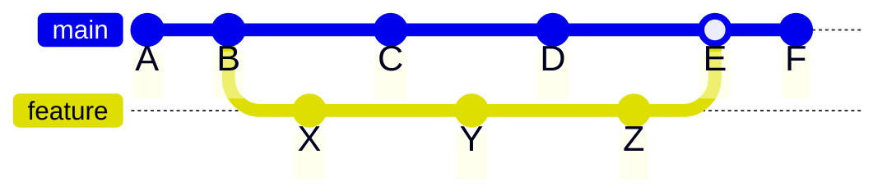

The hierarchical and modular organization of GATK-SV Docker 
images offers a significant advantage: when updating the codebase, 
not every Docker image is affected, minimizing the impact of changes. 
This means that not all Docker images need to be rebuilt and 
published with each pipeline modification. The 
[`build_docker`](https://github.com/broadinstitute/gatk-sv/blob/main/scripts/docker/build_docker.py)
script efficiently tracks these changes and determines which 
Docker images are impacted. Consequently, only the affected Docker 
images are built, saving both storage space and build time.

This incremental and selective building and publishing 
strategy is particularly beneficial considering the size and 
build time of Docker images. By building and publishing 
only the necessary images, we can save on storage space and 
reduce the overall build time. 
This page provides a detailed explanation of 
this incremental and selective approach.

## Determining Modified Files

The incremental build strategy relies on the determination 
of modified files to identify which Docker images require rebuilding. 
Using `git` history, the `build_docker` script automatically 
infers the list of changed files.

To achieve this, the script compares two 
[`git` commit SHAs](https://docs.github.com/en/pull-requests/committing-changes-to-your-project/creating-and-editing-commits/about-commits): 

- `BASE_SHA`: the reference commit representing the base branch 
   (e.g., `broadinstitute/gatk-sv:main`), and;
- `HEAD_SHA`: the target commit representing the latest commit on the feature branch.
             	    

By analyzing the changes between these commits
the script identifies the impacted files and proceeds to 
build the corresponding Docker images.

During manual runs, the user provides the commit SHAs, 
while in automated builds as part of CI/CD, 
the commit SHAs are determined automatically. 

In CI/CD, the commit SHAs are determined as the following example.

In this example, `BASE_SHA=B`, `HEAD_SHA=Z`, and `E` is the merge commit.

## Identifying Images Requiring Rebuilding from Changed Files

The `build_docker` script identifies the list of docker images 
that need to be rebuilt based on two factors. 

1. Directly impacted images are determined by checking the 
list of files each image depends on. If any of these files have 
changed, the corresponding image needs rebuilding. 

2. Indirectly impacted images are identified based on 
the hierarchical dependency between images. 
If a base image is rebuilt, any dependent images built upon 
it also require rebuilding. 
 
This two-step process ensures that all the affected images are correctly 
identified for rebuilding.

A comprehensive mapping of files to their corresponding
Docker images, specifying which images need to be 
rebuilt when their associated files are updated is given in 
[this section](https://github.com/broadinstitute/gatk-sv/blob/e86d59962146ae1770c535a97c2774d825026957/scripts/docker/build_docker.py#L170-L245).
