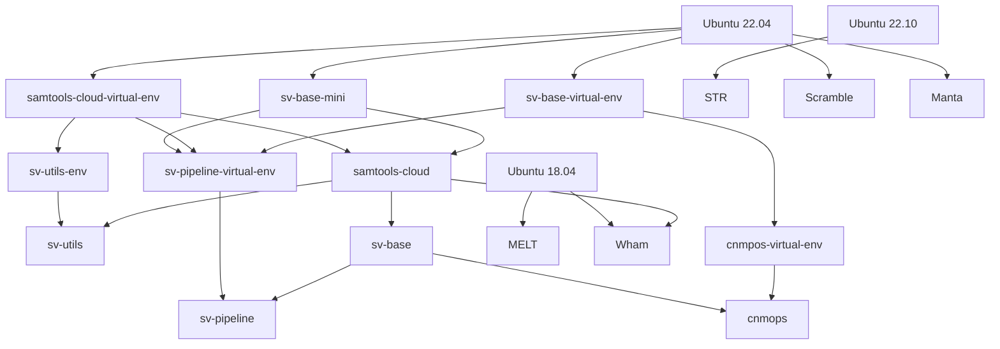
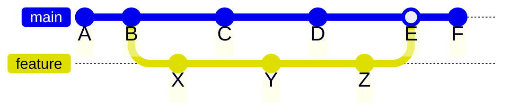

import Tabs from '@theme/Tabs';
import TabItem from '@theme/TabItem';

:::info
This page provides a detailed explanation of Docker 
images and their hierarchy. For information on the process 
of building these images, please refer to the 
[automated](/docs/advanced/docker/automated) or 
[manual](/docs/advanced/docker/manual) builds sections.
:::

GATK-SV organizes the tools, scripts, and their dependencies and configurations 
into multiple Docker images. Each Docker image is built for a specific purpose, 
and images have a hierarchical dependency. 
This modular design has the following key advantages.

- It results in focused and more straightforward instructions in Dockerfiles, 
facilitating their development, maintenance, and extensibility. 

- It results in smaller Docker images, as each image contains only 
the related tools and scripts. Smaller images reduce storage costs on container 
registries and are transferred faster to virtual machines, resulting in shorter start-up. 

- The modular design reduces duplication in Dockerfiles and ensures configuration 
consistency across different Docker images.

- This architecture significantly lowers the maintenance cost as it 
necessitates updating only the affected Docker images throughout the development
(discussed in details in the [following section](#incremental)). 

The following figure illustrates the hierarchical relationship between GATK-SV Docker images. 
The arrows indicate the flow from a base to a derived image, where the derived image 
extends or modifies the tools and configuration it inherits from the base image.

The list of the Docker images and their latest builds 
are available in [`dockers.json`](https://github.com/broadinstitute/gatk-sv/blob/main/inputs/values/dockers.json)
and [`dockers_azure.json`](https://github.com/broadinstitute/gatk-sv/blob/main/inputs/values/dockers_azure.json)
for images hosted on Google Container Registry (GCR) and Azure Container Registry (ACR), respectively.

## Incremental publishing {#incremental}

The hierarchical and modular architecture of GATK-SV Docker images has a significant advantage: 
not every image is affected by every change to the codebase; 
hence, not all Docker images need to be rebuilt and published with every pull request. 
This strategy is particularly beneficial considering the build time and the size of Docker images. 

This strategy is implemented in the build_docker.py script, and it has two main steps as follows.

### Determining modified files

The incremental build strategy relies on identifying the list of files changed between two 
`git` commits and mapping it to the list of Docker images. The 
[`build_docker`](https://github.com/broadinstitute/gatk-sv/blob/main/scripts/docker/build_docker.py) 
extracts the list of changed files from the diff between two 
[`git` commit SHAs](https://docs.github.com/en/pull-requests/committing-changes-to-your-project/creating-and-editing-commits/about-commits): 

- `BASE_SHA`: the reference commit (e.g., `HEAD` of the `main` branch);
- `HEAD_SHA`: the target commit (e.g., the latest commit on the feature branch).

The user provides these commit SHAs (or references the images specifically)
when building the images manually. 
However, the automated CI/CD builds determine the commit SHAs automatically as the following example.

In this example, `BASE_SHA=B`, `HEAD_SHA=Z`, and `E` is the merge commit.

## Identifying Images Requiring Rebuilding from Changed Files

The [`build_docker`](https://github.com/broadinstitute/gatk-sv/blob/main/scripts/docker/build_docker.py) 
script determines the list of docker images 
that need to be rebuilt based on the following conditions. 

1. It determines the list of directly impacted images by checking the 
list of files each image depends on, and rebuilds the image if any of the files have changed.

2. It builds any image if its base image is rebuilt. 
