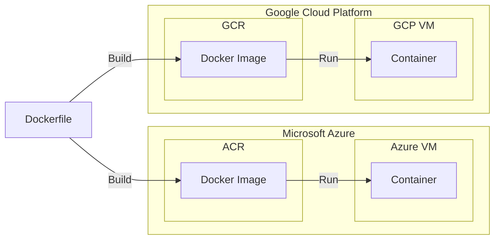

To make the analysis process scalable, reproducible, and cost-efficient,
GATK-SV is designed as a cloud-native pipeline, 
meaning it runs on virtual machines (VMs) hosted in the cloud.
These VMs are pre-configured with all the necessary tools, scripts, and settings 
required to run the GATK-SV analysis reliably. 

To ensure that the analysis can be easily replicated and shared, 
GATK-SV utilizes Docker technology. 
Docker allows the tools and scripts, including all their dependencies and configurations, 
to be packaged into a self-contained unit called a container. 
This container can be deployed and run on different VMs in the cloud, 
making the analysis process consistent and reproducible across multiple experiments or collaborations.

Docker containers are built from Docker images, 
which serve as the blueprints or templates for creating containers.
Dockerfiles are used to define the contents and behavior of a Docker image. 
A Dockerfile is a text file that contains a series of instructions, 
specifying the base image, adding dependencies, configuring settings, 
and executing commands necessary to build the desired software environment within the container.

The following figure is a high-level illustration depicting the relationship 
between Dockerfiles, Docker images, Docker containers, and Cloud VMs.

The GATK-SV Docker setup is organized as follows:

 - **Dockerfile**: 
   These files define the instructions for building the necessary tools and 
   configurations required for the GATK-SV pipeline.

 - **Docker Images**: Docker images are automatically built based on each Dockerfile. 
   These images are stored in both Azure Container Registry (ACR) and 
   Google Cloud Container Registry (GCR). The images serve as self-contained 
   packages that encapsulate all the tools needed for the GATK-SV pipeline.

 - **Docker Containers**: Cromwell, a workflow execution system, creates GATK-SV 
   Docker containers on virtual machines within the Google Cloud Platform (GCP). 
   These containers are instantiated based on the Docker images obtained 
   from GCR. The GATK-SV data analysis tasks are then executed within 
   these containers, providing a consistent and isolated environment.

In summary, the GATK-SV Docker setup involves multiple Dockerfiles defining 
the build instructions, resulting in Docker images that are stored in ACR and GCR. 
These images are used to create Docker containers on GCP virtual machines through Cromwell, 
where the GATK-SV data analysis takes place.
