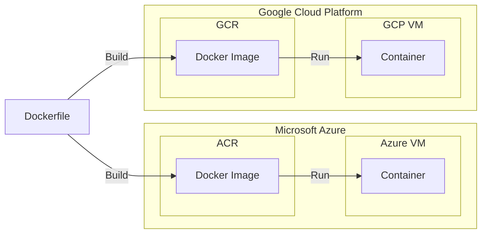

GATK-SV is a cloud-native pipeline, making it scalable and reproducible. 
All of the tools, scripts, and settings required to run the pipeline are 
packaged in multiple Docker images, which are built and hosted 
on container registries and are ready to use in Terra workspaces. 

There are two options for building, testing, and publishing GATK-SV 
docker images: fully automated and manual. 
GATK-SV Docker images are maintained through the automated approach, 
which is built into CI/CD and builds, tests, and publishes images to 
Google Container Registry (GCR) and Azure Container Registry (ACR). 
However, if you are working on extending or improving the GATK-SV Docker images, 
you may need to build them locally
for testing or storing them on an alternative container registry. 
In this section, we provide detailed guidelines on both approaches. 
Specifically, this section covers the following topics:

- [Docker primer](#docker-primer)
- [GATK-SV Docker images](./images)
- [Automatic deployment](./automated)
- [Manual deployment](./manual)

## Docker Primer

Docker technology enables creating a reproducible environment for data analysis. 
It enables defining an environment with all the tools, scripts, 
and their dependencies installed and configured as needed to run a data analysis pipeline. 
The following are the key components to define and run in this environment:

- **Dockerfile**; a text file with instructions on installing and configuring tools, 
  scripts, and their dependencies. It is mainly used to create reproducible Docker images.

- **Docker image**; is a template generated from a Dockerfile and contains all 
  the tools and scripts installed and configured as defined in a Dockerfile. 

- **Docker container**; is an isolated runtime environment created based on a Docker image, 
  which runs on a host machine (e.g., laptop or a virtual machine on the cloud) and can execute scripts. 

The following figure illustrates the relationship between Dockerfiles, Docker images, and Docker containers:

Dockerfiles are text files, and GATK-SV stores them on 
[GitHub](https://github.com/broadinstitute/gatk-sv/tree/main/dockerfiles) 
for accessibility and version control. 
Docker images are larger files (e.g., 1GiB) and should be hosted on container registries 
accessible to runtime environments. GATK-SV stores images on Google Container Registry (GCR) 
and Azure Container Registry (ACR) so they are accessible to the 
workflow execution environment on the Terra platform. 
Docker containers are ephemeral runtime environments, created on 
virtual machines when the analysis starts, and are “purged” when the analysis finishes.

:::tip Images hosted on ACR and GCR are identical
The GATK-SV images hosted on GCR and ACR are identical. 
We maintain these mirrored repositories to enable running GATK-SV on Terra 
with both GCP and Azure (WIP) backends.
:::