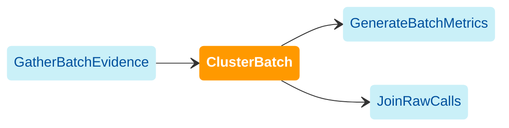

import { Highlight, HighlightOptionalArg } from "@site/src/components/highlight.js"

[WDL source code](https://github.com/broadinstitute/gatk-sv/blob/main/wdl/ClusterBatch.wdl)

Clusters SV calls across a batch. For each caller, redundant variants are merged across samples
into representative variant records based on interval overlap criteria. Some variants will be hard-filtered 
if they overlap with predefined intervals known to pose challenges to SV and CNV callers (e.g. centromeres). 
[GATK-SVCluster](https://gatk.broadinstitute.org/hc/en-us/articles/27007962371099-SVCluster-BETA) 
is the primary tool used in for variant clustering.

The following diagram illustrates the recommended invocation order:

:::note
[GenerateBatchMetrics](./gbm) is the primary downstream module in batch processing. [JoinRawCalls](./jrc) is 
required for genotype filtering but does not need to be run until later in the pipeline.
:::

## Inputs

#### `batch`
An identifier for the batch. Should match the name used in [GatherBatchEvidence](./gbe#batch).

#### `*_vcf_tar`
Standardized VCF tarballs from [GatherBatchEvidence](./gbe#std__vcf_tar)

#### `del_bed`, `dup_bed`
Merged CNV call files (`.bed.gz`) from [GatherBatchEvidence](./gbe#merged_dels-merged_dups)

#### `ped_file`
Family structures and sex assignments determined in [EvidenceQC](./eqc). See [PED file format](/docs/gs/inputs#ped-format).

#### <HighlightOptionalArg>Optional</HighlightOptionalArg>  `N_IQR_cutoff_plotting`
If provided, plot SV counts per sample. This number is used as the cutoff of interquartile range multiples for flagging 
outlier samples. Example value: 4.

## Outputs

#### `clustered_*_vcf`
Clustered variants for each caller (`depth` corresponds to depth-based CNV callers `cnMOPS` and `GATK-gCNV`) in VCF format.

#### <HighlightOptionalArg>Optional</HighlightOptionalArg>  `clustered_sv_counts`, `clustered_sv_count_plots`, `clustered_outlier_samples_preview`, `clustered_outlier_samples_with_reason`, `clustered_num_outlier_samples`
SV count QC tables and plots. Enable by providing [N_IQR_cutoff_plotting](#optional--n_iqr_cutoff_plotting)
