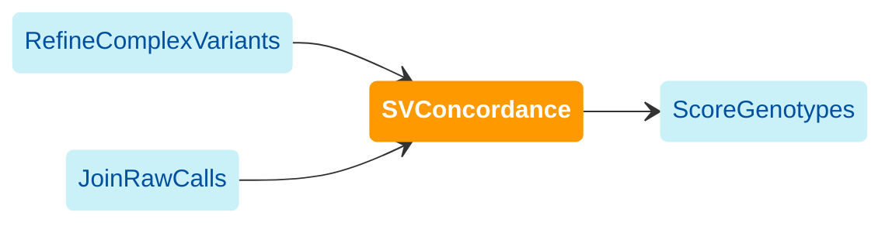

[WDL source code](https://github.com/broadinstitute/gatk-sv/blob/main/wdl/SVConcordance.wdl)

Annotates variants with genotype concordance against another SV call set. This is a general-purpose workflow that can 
be applied to any pair of VCFs containing the same sample set. This is also a prerequisite step for genotype filtering 
in the recommended pipeline: genotypes are compared to calls emitted by raw callers, where low concordance can be indicative 
of poor quality variants. See 
[GATK-SVConcordance](https://gatk.broadinstitute.org/hc/en-us/articles/27007917991707-SVConcordance-BETA) for more 
information on methods.

The following diagram illustrates the recommended invocation order:

### Inputs

#### `output_prefix`
Prefix for the output VCF, such as the cohort name. May be alphanumeric with underscores.

#### `eval_vcf`
VCF to annotate. In the recommended pipeline, this is generated in [RefineComplexVariants](./refcv).

#### `truth_vcf`
VCF to compare against. This should contain the same samples as `eval_vcf`. In the recommended pipeline, this is 
generated in [JoinRawCalls](./jrc).

### Outputs

#### `concordance_vcf`
"Eval" VCF annotated with genotype concordance.

