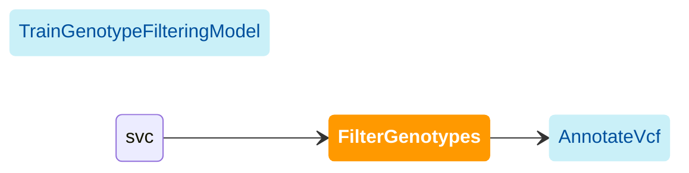

import { Highlight, HighlightOptionalArg } from "@site/src/components/highlight.js"

[WDL source code](https://github.com/broadinstitute/gatk-sv/blob/main/wdl/FilterGenotypes.wdl)

Filter genotypes using the trained model with recalibrated quality scores. The output VCF contains the `HIGH_NCR`  field, which is a filter status assigned to variants exceeding a [threshold proportion](#optional-no_call_rate_cutoff) 
of no-call genotypes. This will also be applied to variants with genotypes that have already been filtered in the input VCF.

The following diagram illustrates the recommended invocation order:

### QC recommendations

We strongly recommend performing call set QC after this module. By default, QC plotting is enabled with the [run_qc](#optional-run_qc) 
argument. Users should carefully inspect the main plots from the [main_vcf_qc_tarball](#optional-main_vcf_qc_tarball).
Please see the [MainVcfQc](./mvqc) module documentation for more information on interpreting these plots and recommended 
QC criteria.

### Inputs

#### `vcf`
Input VCF with recalibrated scores generated from [TrainGenotypeFilteringModel](./tgfm#train_genotype_filtering_model).

#### <HighlightOptionalArg>Optional</HighlightOptionalArg> `output_prefix`
Default: use input VCF filename. Prefix for the output VCF, such as the cohort name. May be alphanumeric with underscores.

#### `ploidy_table`
Table of sample ploidies generated in [JoinRawCalls](./jrc#ploidy_table).

#### `sl_cutoff_table`
An argument for the [SL filtering script](https://github.com/broadinstitute/gatk-sv/blob/main/src/sv-pipeline/scripts/apply_sl_filter.py) which is used to set `SL` cutoffs for filtering. Overridden by [optimized_sl_cutoff_table](#optimized_sl_cutoff_table).

#### <HighlightOptionalArg>Optional</HighlightOptionalArg> `optimized_sl_cutoff_table`
This is an output from the [SL optimization script](https://github.com/broadinstitute/gatk-sv/blob/main/src/sv-pipeline/scripts/optimize_sl_filter.py). This can be used to set `SL` cutoffs for filtering in a more truth-aware manner. Overrides [sl_cutoff_table](#sl_cutoff_table) if passed.

#### <HighlightOptionalArg>Optional</HighlightOptionalArg> `no_call_rate_cutoff`
Default: `0.05`. Threshold fraction of samples that must have no-call genotypes in order to filter a variant. Set to 1 to disable.

#### <HighlightOptionalArg>Optional</HighlightOptionalArg> `run_qc`
Default: `true`. Enable running [MainVcfQc](./mvqc) automatically. By default, filtered variants will be excluded from
the plots.

#### <HighlightOptionalArg>Optional</HighlightOptionalArg> `filter_vcf_records_per_shard`
Default: `20000`. Shard size for scattered `GQ` recalibration tasks. Decrease this if those steps are running slowly.

### Outputs

#### `filtered_vcf`
Filtered VCF.

#### <HighlightOptionalArg>Optional</HighlightOptionalArg> `main_vcf_qc_tarball`
QC plots generated with [MainVcfQc](./mvqc). Only generated if using [run_qc](#optional-run_qc).