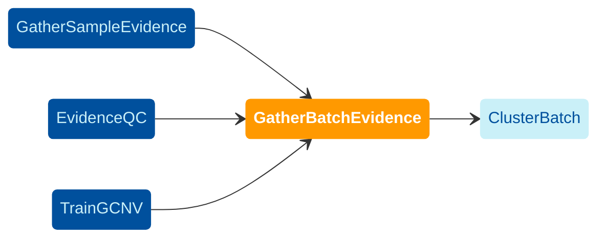

Runs CNV callers ([cn.MOPS](https://academic.oup.com/nar/article/40/9/e69/1136601), GATK gCNV) 
and combines single-sample raw evidence into a batch.




## Inputs
This workflow takes as input the read counts, BAF, PE, SD, SR, and per-caller VCF files 
produced in the GatherSampleEvidence workflow, and contig ploidy and gCNV models from 
the TrainGCNV workflow.
The following is the list of the inputs the GatherBatchEvidence workflow takes.


#### `batch`
An identifier for the batch.


#### `samples`
Sets the list of sample IDs. 


#### `counts`
Set to the [`GatherSampleEvidence.coverage_counts`](./gse#coverage-counts) output.


#### Raw calls

The following inputs set the per-caller raw SV calls, and should be set 
if the caller was run in the [`GatherSampleEvidence`](./gse) workflow.
You may set each of the following inputs to the linked output from 
the GatherSampleEvidence workflow.


- `manta_vcfs`: [`GatherSampleEvidence.manta_vcf`](./gse#manta-vcf);
- `melt_vcfs`: [`GatherSampleEvidence.melt_vcf`](./gse#melt-vcf);
- `scramble_vcfs`: [`GatherSampleEvidence.scramble_vcf`](./gse#scramble-vcf);
- `wham_vcfs`: [`GatherSampleEvidence.wham_vcf`](./gse#wham-vcf).

#### `PE_files`
Set to the [`GatherSampleEvidence.pesr_disc`](./gse#pesr-disc) output.

#### `SR_files`
Set to the [`GatherSampleEvidence.pesr_split`](./gse#pesr-split)


#### `SD_files`
Set to the [`GatherSampleEvidence.pesr_sd`](./gse#pesr-sd)


#### `matrix_qc_distance`
You may set it to `1000000`.


#### `min_svsize`
Sets the minimum size of SVs to include. 
You may set it to `50`. 


#### `ped_file`
A pedigree file describing the familial relationshipts between the samples in the cohort.
The file needs to be in the 
[PED format](https://gatk.broadinstitute.org/hc/en-us/articles/360035531972-PED-Pedigree-format).
Updated with [EvidenceQC](./eqc) sex assignments, including 
`sex = 0` for sex aneuploidies. Calls will not be made on sex chromosomes 
when `sex = 0` in order to avoid generating many confusing calls 
or upsetting normalized copy numbers for the batch.


#### `run_matrix_qc`
Enables or disables running optional QC tasks. 


#### cn.MOPS files
The workflow needs the following cn.MOPS files.

- `cnmops_chrom_file` and `cnmops_allo_file`: FASTA index files (`.fai`) for respectively non-sex chromosome (autosome) and chromosomes X and Y (allosomes). 
  The content of the files may read as the following, 
  and the format is explained [on this page](https://www.htslib.org/doc/faidx.html).

  ```bash
  chrX    156040895       2903754205      100     101
  chrY    57227415        3061355656      100     101
  ```

  You may use the following files for these fields:

  ```json
  "cnmops_chrom_file": "gs://gcp-public-data--broad-references/hg38/v0/sv-resources/resources/v1/autosome.fai"
  "cnmops_allo_file": "gs://gcp-public-data--broad-references/hg38/v0/sv-resources/resources/v1/allosome.fai"
  ```
  
- `cnmops_exclude_list`: You may use the following file for this field.
  ```
  gs://gcp-public-data--broad-references/hg38/v0/sv-resources/resources/v1/GRCh38_Nmask.bed
  ```

#### GATK-gCNV inputs

The following inputs are configured based on the outputs generated in the [`TrainGCNV`](./gcnv) workflow.

- `contig_ploidy_model_tar`: [`TrainGCNV.cohort_contig_ploidy_model_tar`](./gcnv#contig-ploidy-model-tarball)
- `gcnv_model_tars`: [`TrainGCNV.cohort_gcnv_model_tars`](./gcnv#model-tarballs)


The workflow also enables setting a few optional arguments of gCNV.
The arguments and their default values are as the following,
and each argument is documented on 
[this page](https://gatk.broadinstitute.org/hc/en-us/articles/360037593411-PostprocessGermlineCNVCalls).

```json
"gcnv_qs_cutoff": 30,
"gcnv_caller_internal_admixing_rate": 0.5,
"gcnv_caller_update_convergence_threshold": 0.000001,
"gcnv_cnv_coherence_length": 1000,
"gcnv_convergence_snr_averaging_window": 100,
"gcnv_convergence_snr_countdown_window": 10,
"gcnv_convergence_snr_trigger_threshold": 0.2,
"gcnv_copy_number_posterior_expectation_mode": "EXACT",
"gcnv_depth_correction_tau": 10000,
"gcnv_learning_rate": 0.03,
"gcnv_log_emission_sampling_median_rel_error": 0.001,
"gcnv_log_emission_sampling_rounds": 20,
"gcnv_max_advi_iter_first_epoch": 1000,
"gcnv_max_advi_iter_subsequent_epochs": 200,
"gcnv_max_training_epochs": 5,
"gcnv_min_training_epochs": 1,
"gcnv_num_thermal_advi_iters": 250,
"gcnv_p_alt": 0.000001,
"gcnv_sample_psi_scale": 0.000001,
"ref_copy_number_autosomal_contigs": 2
```


#### Docker images

The workflow needs the following Docker images, which you may find a link to their 
latest images from [this file](https://github.com/broadinstitute/gatk-sv/blob/main/inputs/values/dockers.json).

  - `cnmops_docker`;
  - `condense_counts_docker`;
  - `linux_docker`;
  - `sv_base_docker`;
  - `sv_base_mini_docker`;
  - `sv_pipeline_docker`;
  - `sv_pipeline_qc_docker`;
  - `gcnv_gatk_docker`;
  - `gatk_docker`.

#### Static inputs

```json
"primary_contigs_fai": "gs://gcp-public-data--broad-references/hg38/v0/sv-resources/resources/v1/contig.fai",
"cytoband": "gs://gcp-public-data--broad-references/hg38/v0/sv-resources/resources/v1/cytobands_hg38.bed.gz",
"ref_dict": "gs://gcp-public-data--broad-references/hg38/v0/Homo_sapiens_assembly38.dict",
"mei_bed": "gs://gcp-public-data--broad-references/hg38/v0/sv-resources/resources/v1/mei_hg38.bed.gz",
"genome_file": "gs://gcp-public-data--broad-references/hg38/v0/sv-resources/resources/v1/hg38.genome",
"sd_locs_vcf": "gs://gcp-public-data--broad-references/hg38/v0/Homo_sapiens_assembly38.dbsnp138.vcf"
```

#### Optional Inputs
The following is the list of a few optional inputs of the 
workflow, with an example of possible values. 

- `"allosomal_contigs": [["chrX", "chrY"]]`
- `"ploidy_sample_psi_scale": 0.001`


### Outputs

- Combined read count matrix, SR, PE, and BAF files
- Standardized call VCFs
- Depth-only (DEL/DUP) calls
- Per-sample median coverage estimates
- (Optional) Evidence QC plots
