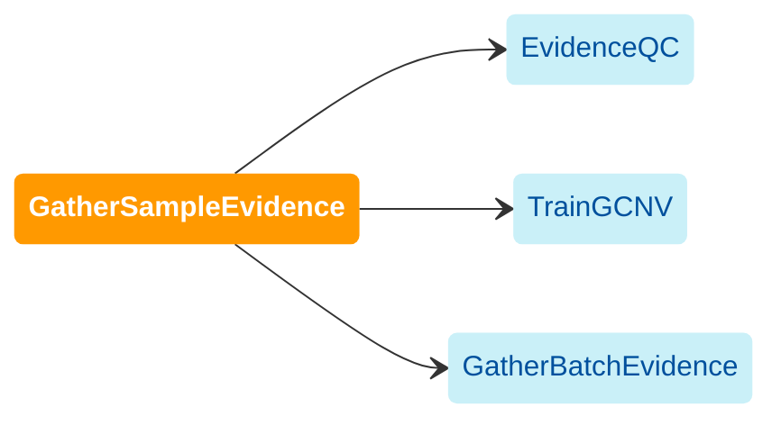

Runs raw evidence collection on each sample with the following SV callers: 
Manta, Wham, Scramble, and/or MELT. For guidance on pre-filtering prior to GatherSampleEvidence, 
refer to the Sample Exclusion section.

The downstream dependencies of the GatherSampleEvidence workflow 
are illustrated in the following diagram.




## Inputs

#### `bam_or_cram_file`
A BAM or CRAM file aligned to hg38. Index file (.bai) must be provided if using BAM.

#### `sample_id`
Refer to the [sample ID requirements](/docs/gs/inputs#sampleids) for specifications of allowable sample IDs. 
IDs that do not meet these requirements may cause errors.

#### `preprocessed_intervals`
Picard interval list.

#### `sd_locs_vcf`
(`sd`: site depth) 
A VCF file containing allele counts at common SNP loci of the genome, which is used for calculating BAF.  
For human genome, you may use [`dbSNP`](https://www.ncbi.nlm.nih.gov/snp/) 
that contains a complete list of common and clinical human single nucleotide variations, 
microsatellites, and small-scale insertions and deletions. 
You may download the file from the following link.

```shell
gs://gcp-public-data--broad-references/hg38/v0/Homo_sapiens_assembly38.dbsnp138.vcf
```

## Outputs

- Caller VCFs (Manta, Scramble, Wham, and/or MELT)
- Binned read counts file
- Split reads (SR) file
- Discordant read pairs (PE) file

#### `manta_vcf` {#manta-vcf}

#### `melt_vcf` {#melt-vcf}

#### `scramble_vcf` {#scramble-vcf}

#### `wham_vcf` {#wham-vcf}

#### `coverage_counts` {#coverage-counts}

#### `pesr_disc` {#pesr-disc}

#### `pesr_split` {#pesr-split}

#### `pesr_sd` {#pesr-sd}