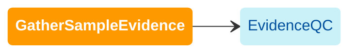

import { Highlight, HighlightOptionalArg } from "../../src/components/highlight.js"

[WDL source code](https://github.com/broadinstitute/gatk-sv/blob/main/wdl/GatherSampleEvidence.wdl)

Runs raw evidence collection (PE/SR/RD/SD) on each sample and performs SV discovery with the following callers: 
Manta, Wham, and Scramble. For guidance on pre-filtering prior to GatherSampleEvidence, refer to the 
[Input data](/docs/gs/inputs) section.

:::note
MELT is no longer supported as a raw caller. Please see [SV/CNV callers](/docs/gs/sv_callers) for more information.
:::

The following diagram illustrates the recommended invocation order:

### Inputs

#### `bam_or_cram_file`
An indexed BAM or CRAM file aligned to hg38. See [input data requirements](/docs/gs/inputs).

#### `sample_id`
Identifier string for the sample. Refer to the [sample ID requirements](/docs/gs/inputs#sampleids) 
for specifications of allowable sample IDs. IDs that do not meet these requirements may lead to errors.

#### <HighlightOptionalArg>Optional</HighlightOptionalArg> `collect_coverage` {#collect-coverage}
Default: `true`. Collect read depth.

#### <HighlightOptionalArg>Optional</HighlightOptionalArg> `collect_pesr` {#collect-pesr}
Default: `true`. Collect paired-end (PE) split-read (SR), and site depth (SD) evidence.

#### <HighlightOptionalArg>Optional</HighlightOptionalArg> `manta_docker` {#manta-docker}
Manta docker image. If provided, runs the Manta tool.

#### <HighlightOptionalArg>Optional</HighlightOptionalArg> `melt_docker` {#melt-docker}
MELT docker image. If provided, runs the MELT tool.

#### <HighlightOptionalArg>Optional</HighlightOptionalArg> `scramble_docker` {#scramble-docker}
Scramble docker image. If provided, runs the Scramble tool.

#### <HighlightOptionalArg>Optional</HighlightOptionalArg> `wham_docker` {#wham-docker}
Wham docker image. If provided, runs the Wham tool.

### Advanced parameters

#### <HighlightOptionalArg>Optional</HighlightOptionalArg> `run_localize_reads`
Default: `false`. Copy input alignment files to the execution bucket before localizing to subsequent tasks. This 
may be desirable when BAM/CRAM files are stored in a requester-pays bucket or in another region to avoid egress charges.

:::warning
Enabling `run_localize_reads` can incur high storage costs. If using, make sure to clean up execution directories after 
the workflow finishes running.
:::

#### <HighlightOptionalArg>Optional</HighlightOptionalArg> `run_module_metrics`
Default: `true`. Calculate QC metrics for the sample. If true, `primary_contigs_fai` must also be provided, and 
optionally the `baseline_*_vcf` inputs to run comparisons. 

#### <HighlightOptionalArg>Optional</HighlightOptionalArg> `move_bam_or_cram_files`
Default: `false`. Uses `mv` instead of `cp` when operating on local CRAM/BAM files in some tasks. This can result in 
some performance improvement.

:::warning
Do not use `move_bam_or_cram_files` if running with a local backend or shared filesystem, as it may cause loss of 
input data.
:::

### Outputs

#### <HighlightOptionalArg>Optional</HighlightOptionalArg> `manta_vcf` {#manta-vcf}
VCF containing variants called by Manta. Enabled by providing [manta_docker](#manta-docker).

#### <HighlightOptionalArg>Optional</HighlightOptionalArg> `melt_vcf` {#melt-vcf}
VCF containing variants called by MELT. Enabled by providing [melt_docker](#melt-docker).

#### <HighlightOptionalArg>Optional</HighlightOptionalArg> `scramble_vcf` {#scramble-vcf}
VCF containing variants called by Scramble. Enabled by providing [scramble_docker](#scramble-docker).

#### <HighlightOptionalArg>Optional</HighlightOptionalArg> `wham_vcf` {#wham-vcf}
VCF containing variants called by Wham. Enabled by providing [wham_docker](#wham-docker).

#### <HighlightOptionalArg>Optional</HighlightOptionalArg>  `coverage_counts` {#coverage-counts}
Binned read counts collected by `GATK-CollectReadCounts` (`*.counts.tsv.gz`). Enabled with [collect_coverage](#collect-coverage).

#### <HighlightOptionalArg>Optional</HighlightOptionalArg>  `pesr_disc` {#pesr-disc}
Discordant read pairs collected by `GATK-CollectSVEvidence` (`*.pe.txt.gz`). Enabled with [collect_pesr](#collect-pesr).

#### <HighlightOptionalArg>Optional</HighlightOptionalArg>  `pesr_split` {#pesr-split}
Split read positions collected by `GATK-CollectSVEvidence` (`*.sr.txt.gz`). Enabled with [collect_pesr](#collect-pesr).

#### <HighlightOptionalArg>Optional</HighlightOptionalArg>  `pesr_sd` {#pesr-sd}
Site depth counts collected by `GATK-CollectSVEvidence` (`*.sd.txt.gz`). Enabled with [collect_pesr](#collect-pesr).

#### <HighlightOptionalArg>Optional</HighlightOptionalArg> `sample_metrics_files`
Sample metrics for QC. Enabled with [run_module_metrics](#optional-run_module_metrics).