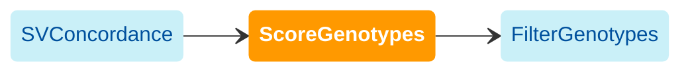

import { Highlight, HighlightOptionalArg } from "@site/src/components/highlight.js"

[WDL source code](https://github.com/broadinstitute/gatk-sv/blob/main/wdl/ScoreGenotypes.wdl)

Calibrate quality scores to provide as input to a machine learning model based on [xgboost](https://github.com/dmlc/xgboost), which is then used to filter genotypes. The output VCF contains the following updated fields:

- `SL` : Scaled logit scores (see [here](#sl-scores))
- `GQ` : Updated genotype quality rescaled using `SL`
- `OGQ` : Original `GQ` score before recalibration

The following diagram illustrates the recommended invocation order:



### Model features

The model uses the following features:

* Genotype properties:
    * Non-reference and no-call allele counts
    * Genotype quality (`GQ`)
    * Supporting evidence types (`EV`) and respective genotype qualities (`PE_GQ`, `SR_GQ`, `RD_GQ`)
    * Raw call concordance (`CONC_ST`)
* Variant properties:
    * Variant type (`SVTYPE`) and size (`SVLEN`)
    * Calling algorithms (`ALGORITHMS`)
    * Supporting evidence types (`EVIDENCE`)
    * Two-sided SR support flag (`BOTHSIDES_SUPPORT`)
    * Evidence overdispersion flag (`PESR_GT_OVERDISPERSION`)
    * SR noise flag (`HIGH_SR_BACKGROUND`)
    * Raw call concordance (`STATUS`, `NON_REF_GENOTYPE_CONCORDANCE`, `VAR_PPV`, `VAR_SENSITIVITY`, `TRUTH_AF`)
* Reference context with respect to UCSC Genome Browser tracks:
    * RepeatMasker
    * Segmental duplications
    * Simple repeats
    * K-mer mappability (umap_s100 and umap_s24)

### Model availability

For ease of use, we provide a model pre-trained on high-quality data with truth data derived from long-read calls:
```
gs://gatk-sv-resources-public/hg38/v0/sv-resources/resources/v1/gatk-sv-recalibrator.aou_phase_1.v1.model
```
See the SV "Genotype Filter" section on page 34 of the [All of Us Genomic Quality Report C2022Q4R9 CDR v7](https://support.researchallofus.org/hc/en-us/articles/4617899955092-All-of-Us-Genomic-Quality-Report-ARCHIVED-C2022Q4R9-CDR-v7) for further details on model optimization. The generation and release of this model was made possible by the All of Us program (see [here](/docs/acknowledgements)).

### SL scores

All valid genotypes are annotated with a _scaled logit_ (`SL`) score, which is rescaled to non-negative adjusted `GQ` values on [1, 99]. Note that the rescaled `GQ` values should *not* be interpreted as probabilities. Original genotype qualities are retained in the `OGQ` field.

A more positive `SL` score indicates higher probability that the given genotype is not homozygous for the reference allele. Genotypes are therefore filtered using `SL` thresholds that depend on SV type and size. This workflow also generates QC plots using the [MainVcfQc](https://github.com/broadinstitute/gatk-sv/blob/main/wdl/MainVcfQc.wdl) workflow to review call set quality (see below for recommended practices).

### Modes

The combination of this and the following `FilterGenotypes` workflow can be run in one of two modes:

1. (Recommended) The user does not provide truth labels to be optimized SL cutoffs based on, and instead explicitly provides a set of `SL` cutoffs through the `sl_cutoff_table` parameter in `FilterGenotypes`, e.g.
    ```
    sv_type	min_size	max_size	sl_cutoff
    DEL	-1	500	93
    DEL	500	10000	150
    DUP	-1	500	-51
    DUP	500	10000	-4
    INS	-1	-1	-13
    INV	-1	-1	-19
    ```
    wherein each row corresponds to a `sl_cutoff` between the size range of `min_size` (inclusive) and `max_size` (exclusive), and a `-1` corresponds to a non-existent size limit in either direction.
    
    Genotypes with `SL` scores less than the cutoffs are set to no-call (`./.`). The above values were taken directly from Appendix N of the [All of Us Genomic Quality Report C2022Q4R9 CDR v7 ](https://support.researchallofus.org/hc/en-us/articles/4617899955092-All-of-Us-Genomic-Quality-Report-ARCHIVED-C2022Q4R9-CDR-v7). Users should adjust the thresholds depending on data quality and desired accuracy. Please see the arguments in [this script](https://github.com/broadinstitute/gatk-sv/blob/main/src/sv-pipeline/scripts/apply_sl_filter.py) for all available options.

2. (Advanced) The user provides truth labels for a subset of non-reference calls through the `truth_json` parameter in `ScoreGenotypes`, e.g.
   ```json
    {
      "sample_1": 
      {
        "good_variant_ids": ["variant_1", "variant_3"], 
        "bad_variant_ids": ["variant_5", "variant_10"]
      },
      "sample_2": 
      {
        "good_variant_ids": ["variant_2", "variant_13"], 
        "bad_variant_ids": ["variant_8", "variant_11"]
      }
    }
    ```
		wherein "good_variant_ids" and "bad_variant_ids" are lists of variant IDs corresponding to non-reference (i.e. het or hom-var) sample genotypes that are true positives and false positives, respectively. 

  	This approach allows `SL` cutoffs to automatically be optimized, and are hence eventually passed in through the `optimized_sl_cutoff_table` parameter in `FilterGenotypes`. These cutoffs are optimized by maximizing the [F-score](https://en.wikipedia.org/wiki/F-score) with "beta" parameter `fmax_beta`, which modulates the weight given to precision over recall (lower values give higher precision).

### Inputs

#### `vcf`
Input VCF generated from [SVConcordance](./svc#concordance_vcf).

#### <HighlightOptionalArg>Optional</HighlightOptionalArg> `output_prefix`
Default: use input VCF filename. Prefix for the output VCF, such as the cohort name. May be alphanumeric with underscores.

#### `gq_recalibrator_model_file`
GQ-Recalibrator model. A public model is listed as `aou_recalibrate_gq_model_file` [here](https://github.com/broadinstitute/gatk-sv/blob/main/inputs/values/resources_hg38.json).

#### `recalibrate_gq_args`
Arguments to pass to the `GQ` recalibration tool. Users should leave this with the default configuration in Terra.

#### `genome_tracks`
Genome tracks for sequence context annotation. Users should leave this with the default configuration in Terra.

#### <HighlightOptionalArg>Optional</HighlightOptionalArg> `fmax_beta`
Default: `0.4`. If providing a truth set, defines the beta parameter for F-score optimization.

#### <HighlightOptionalArg>Optional</HighlightOptionalArg> `truth_json`
Truth labels for input variants. If provided, the workflow will attempt to optimize filtering cutoffs automatically using the F-score.

#### <HighlightOptionalArg>Optional</HighlightOptionalArg> `optimize_vcf_records_per_shard`
Default: `50000`. Shard size for scattered cutoff optimization tasks. Decrease this if those steps are running slowly.

### Outputs

#### `unfiltered_recalibrated_vcf`
VCF that contains `SL` genotype scores that have not yet gone through filtering.

#### <HighlightOptionalArg>Optional</HighlightOptionalArg> `vcf_optimization_table`
Table of cutoff optimization metrics. Only generated if [truth_json](#optional-truth_json) is provided.

#### <HighlightOptionalArg>Optional</HighlightOptionalArg> `sl_cutoff_table`
Table that contains optimized SL cutoffs. Only generated if [truth_json](#optional-truth_json) is provided.

#### <HighlightOptionalArg>Optional</HighlightOptionalArg> `sl_cutoff_qc_tarball`
Cutoff optimization and QC plots. Only generated if [truth_json](#optional-truth_json) is provided.