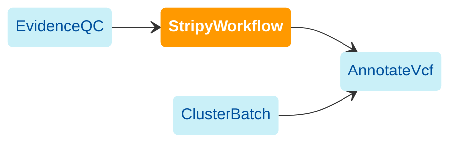

import { HighlightOptionalArg } from "@site/src/components/highlight.js"

[WDL source code](https://github.com/broadinstitute/gatk-sv/blob/main/wdl/StripyWorkflow.wdl)

`StripyWorkflow` is an optional standalone workflow that runs
[STRipy](https://stripy.org/) on a single sample to genotype a curated set of known pathogenic
short tandem repeat (STR) expansions. It is intended for targeted follow-up rather than
genome-wide STR discovery.

In joint-calling workflows, this module is typically run after [EvidenceQC](./eqc) and sample QC
once the cohort PED file has been finalized. The resulting single-sample STRipy VCFs can then be
merged in [ClusterBatch](./cb) and appended to the final cohort VCF in [AnnotateVcf](./av).

The following diagram illustrates the recommended invocation order:

:::note
This workflow is optional. Run it only for samples where targeted analysis of known pathogenic STR
expansions is desired.
:::

## Inputs

#### `bam_or_cram_file`
Sample alignment file in BAM or CRAM format.

#### <HighlightOptionalArg>Optional</HighlightOptionalArg> `bam_or_cram_index`
Index for the input BAM or CRAM. If omitted, the workflow expects the index to be located beside
the input file using the standard `.bai` or `.crai` extension.

#### `ped_file`
PED file used to look up the sample sex for STRipy. See [PED file format](/docs/gs/inputs#ped-format).

#### `reference_fasta`, `reference_fasta_fai`
Reference FASTA and FASTA index matching the aligned sample.

#### `sample_name`
Sample identifier. This must match the sample ID in the PED file.

#### <HighlightOptionalArg>Optional</HighlightOptionalArg> `genome_build`
Reference build name passed to STRipy. Default: `hg38`.

#### <HighlightOptionalArg>Optional</HighlightOptionalArg> `locus`
Comma-separated list of loci to analyze. By default, the workflow runs STRipy on its built-in panel
of known pathogenic repeat-expansion loci.

#### <HighlightOptionalArg>Optional</HighlightOptionalArg> `custom_catalog`
Custom STRipy catalog file. Use this to add or override loci beyond the default pathogenic panel.

#### <HighlightOptionalArg>Optional</HighlightOptionalArg> `analysis`
STRipy analysis mode. Default: `standard`.

#### <HighlightOptionalArg>Optional</HighlightOptionalArg> `config`
Base STRipy configuration file.

#### <HighlightOptionalArg>Optional</HighlightOptionalArg> `verbose`
Enable verbose STRipy logging. Default: `false`.

## Outputs

#### `stripy_json`
Per-sample STRipy JSON output.

#### `stripy_tsv`
Per-sample STRipy tabular summary.

#### `stripy_html`
Per-sample STRipy HTML report.

#### <HighlightOptionalArg>Optional</HighlightOptionalArg> `stripy_vcf`
Single-sample STRipy VCF for downstream merging in [ClusterBatch](./cb) and optional inclusion in
the final cohort VCF.