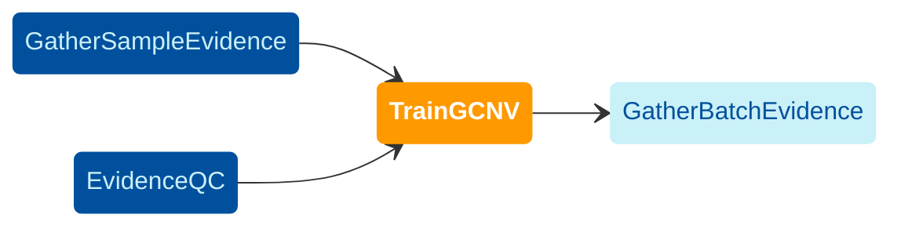

[GATK-gCNV](https://www.nature.com/articles/s41588-023-01449-0)
is a method for detecting rare germline copy number variants (CNVs)
from short-read sequencing read-depth information.
The [TrainGCNV](https://github.com/broadinstitute/gatk-sv/blob/main/wdl/TrainGCNV.wdl)
module trains a gCNV model for use in the [GatherBatchEvidence](./gbe) workflow. 
The upstream and downstream dependencies of the TrainGCNV module are illustrated in the following diagram. 

<br/>



<br/>


The samples used for training should be homogeneous and similar 
to the samples on which the model will be applied in terms of sample type, 
library preparation protocol, sequencer, sequencing center, and etc.


For small, relatively homogeneous cohorts, a single gCNV model is usually sufficient. 
However, for larger cohorts, especially those with multiple data sources, 
it is necessary to train a separate model for each batch or group of batches 
with a similar dosage score (WGD). 
The model can be trained on all or a subset of the samples to which it will be applied. 
A subset of 100 randomly selected samples from the batch is a reasonable 
input size for training the model; also, the `TrainGCNV` workflow can automatically select 
a given number of random samples through the `n_samples_subsample` parameter.


## Inputs

This section provides a brief description on the _required_ inputs of the TrainGCNV workflow.
For a description on the _optional_ inputs and their default values, you may refer to the 
[source code](https://github.com/broadinstitute/gatk-sv/blob/main/wdl/TrainGCNV.wdl) of the TrainGCNV workflow.
Additionally, the majority of the optional inputs of the workflow map to the optional arguments of the 
tool the workflow uses, `GATK GermlineCNVCaller`; hence, you may refer to the 
[documentation](https://gatk.broadinstitute.org/hc/en-us/articles/360040097712-GermlineCNVCaller) 
of the tool for a description on these optional inputs. 

- `samples`: a list of sample IDs. 
  The order of IDs in this list, should match the order of files in `count_files .

- `count_files`: a list of per-sample coverage counts determined in the [GatherSampleEvidence](./gse#outputs) workflow.

- `contig_ploidy_priors`: a tabular file with ploidy prior probability per contig. 
  You may use the following file as this input:
    
  ```
  gs://gatk-sv-resources-public/gcnv-exome/contig_ploidy_prior_hg38.tsv
  ```

  <details>
    <summary>File description</summary>
    <p>
      This is a tabular file with the following columns: 
      <code>CONTIG_NAME</code>, <code>PLOIDY_PRIOR_0</code>, <code>PLOIDY_PRIOR_1</code>, 
      <code>PLOIDY_PRIOR_2</code>, <code>PLOIDY_PRIOR_3</code>.
    </p>
    <p>
      The <code>CONTIG_NAME</code> column lists contigs (e.g., <code>chr1</code>, <code>chrX</code>, 
      <code>chrY</code>, or <code>chrM</code>). 
      The <code>PLOIDY_PRIOR</code> columns refer to the copy number of the contig of interest 
      and represent the prior probability that the contig takes on that copy number in any given sample. 
      The values in each row should sum to one. 
      This file primarily specifies the sex chromosomes and the expected counts of <code>chrX</code> and 
      <code>chrY</code> for males and females. 
      For humans, autosomes are most likely to have a ploidy of 2, 
      though zero, one, or three copies are also possible but unlikely. 
      For <code>chrX</code>, ploidy 1 or 2 are equally likely, meaning no assumptions are made about the sample's sex, 
      and this tool often helps determine it. Please refer 
      to <a href="https://gatk.broadinstitute.org/hc/en-us/community/posts/360074399831-What-is-contig-ploidy-priors-table-and-how-to-make-it">this page</a> for 
      more details.
    </p>
  </details>


- `reference_fasta`, `reference_index`, `reference_dict`:
  reference genome sequence in the FASTA format, its index file, and a corresponding 
  [dictionary file](https://gatk.broadinstitute.org/hc/en-us/articles/360035531652-FASTA-Reference-genome-format).
  You may use the following files for these inputs.

  ```json
  "reference_fasta": "gs://gcp-public-data--broad-references/hg38/v0/Homo_sapiens_assembly38.fasta",
  "reference_index": "gs://gcp-public-data--broad-references/hg38/v0/Homo_sapiens_assembly38.fasta.fai",
  "reference_dict" : "gs://gcp-public-data--broad-references/hg38/v0/Homo_sapiens_assembly38.dict"
  ```


## Outputs

- `annotated_intervals` [Optional]. 
  Count files from [GatherSampleEvidence](./gse) with adjacent intervals combined into 
  locus-sorted `DepthEvidence` files using `GATK CondenseDepthEvidence` tool, which are
  annotated with GC content, mappability, and segmental-duplication content using 
  [`GATK AnnotateIntervals`](https://gatk.broadinstitute.org/hc/en-us/articles/360041416652-AnnotateIntervals).
  This output is generated if the optional input `do_explicit_gc_correction` is set to `True`.

- Contig ploidy model tarball
- gCNV model tarballs